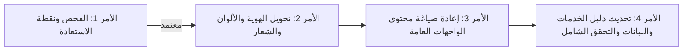

# تقرير المرحلة الأولى — الأمر 1 من 4: فحص المشروع وإنشاء نقطة استعادة قبل تحويل الهوية
**تاريخ الفحص:** 19 سبتمبر 2026  
**مسار المشروع المحلي:** `D:\FACSSS`  
**بيئة التشغيل:** Windows 10/11 | Node.js v20+ | Next.js 14.2.15 (App Router) | PostgreSQL (127.0.0.1:5432)  

---

## 1. ملخص تنفيذي

تنفيذًا لتوجيهات **الأمر 1 من 4 للمرحلة الأولى**، تم إنجاز أعمال الفحص الفني المستقل للقراءة فقط (Read-Only Inspection)، وتأمين نقطة استعادة شاملة وغير قابلة للضياع لكافة ملفات المشروع وتعديلاته السابقة، وإعداد خريطة طريق متكاملة للتحول من هوية منصة **مركز عدن الأول للخدمات الأمنية والدراسات الاستراتيجية (FACSS)** إلى الهوية المؤسسية الجديدة:

- **الاسم العربي المعتمد:** مركز عدن الدولي للسلامة والدراسات الميدانية
- **الاسم الإنجليزي المعتمد:** Aden International Center for Safety and Field Assessment
- **الصفة القانونية:** مؤسسة فردية مهنية/استشارية وفق متطلبات التسجيل والترخيص النافذة في الجمهورية اليمنية.

> [!IMPORTANT]
> **التزام تام بضوابط النطاق (Scope Controls):**
> - لم يتم تعديل أي سطر برمجي في كود المنصة التشغيلي أو منطق الأعمال في هذا الأمر.
> - لم يتم المساس بقاعدة البيانات المحلية أو حذف جداول أو إضافة/تعديل سجلات.
> - لم يتم تشغيل أي سكربت تأسيسي أو تهيئة حساب مدير جديد.
> - لم يتم فتح أو طباعة محتويات ملفات البيئة `.env` أو الأسرار أو سلاسل الاتصال الحساسة.
> - تم استبعاد وتأمين جميع الملفات التي قد تحوي أسرارًا قبل إنشاء نقطة الاستعادة.

---

## 2. إنشاء نقطة الاستعادة الآمنة (Safe Restore Point)

### 2.1. منهجية نقطة الاستعادة
نظرًا لوجود تعديلات شاملة وغير ملتزم بها (Uncommitted Changes) من مراحل التطوير والتدقيق السابقة (Phases 2A through 2G.5) تشمل 47 ملفًا معدلًا والعديد من المكونات والوحدات البرمجية والتقارير الجديدة، تم اتباع الإجراءات الوقائية التالية:

1. **عزل الأسرار محليًا في Git:**
   تم إضافة الملفات والأنماط الحساسة التالية إلى `.git/info/exclude` (وهو ملف ضبط محلي خاص بمستودع Git لا يُدرج ضمن شجرة الملفات المتتبعة):
   - `.env*` و `*.backup`
   - `New Text Document.txt` (تم رصد احتوائه على سلسلة اتصال خارجية، وتم عزله ومنع إضافته تمامًا)
   - `storage/` (ملفات المرفقات التجريبية المؤقتة)

2. **تأمين كافة التغييرات والملفات في نقطة التزام (Git Commit):**
   تم تضمين كافة ملفات المشروع البرمجية والمكونات وصفحات الواجهة ومسارات API والتقارير وقوالب الهجرة، وتسجيلها في Commit رسمي على فرع `main`.

3. **تثبيت نقطة الاستعادة بفرع مستقل وعلامة إصدار (Tag & Branch):**
   - **Commit SHA:** `921277e`
   - **رسالة الالتزام:** `checkpoint(restore-point): FACSS Phase 2G.5 baseline prior to identity transformation`
   - **الفرع الاحتياطي الدائم (Dedicated Branch):** `checkpoint/facss-original-platform`
   - **العلامة المرجعية (Annotated Tag):** `v-facss-pre-pivot`
   - **حالة شجرة العمل بعد الإجراء:** `working tree clean` (نظيفة تمامًا، بدون أي فقد أو تجاهل لعمل سابق).

### 2.2. تعليمات الرجوع السريع (Rollback Procedures)
في حال الرغبة في الرجوع إلى الحالة السابقة بالكامل قبل بدء التحول:
```powershell
# الرجوع الكامل لمنظومة FACSS الأصلية في أي وقت:
git checkout v-facss-pre-pivot

# أو الانتقال إلى الفرع الاحتياطي:
git checkout checkpoint/facss-original-platform

# لاستعادة ملف أو مجلد محدد بعينه من نقطة الاستعادة دون التأثير على بقية الملفات:
git checkout v-facss-pre-pivot -- app/services/page.tsx
```

---

## 3. نتائج فحوص القراءة فقط للمشروع والبيئة

| الفحص | الأداة | النتيجة | التفاصيل الفنية |
| :--- | :--- | :---: | :--- |
| **فحص الأنواع البرمجية** | `npx tsc --noEmit` | **ناجح (0 أخطاء)** | سلامة واجهات TypeScript وتطابق الأنواع 100% في كافة المسارات. |
| **التحقق من مخطط البيانات** | `npx prisma validate` | **ناجح (0 أخطاء)** | المخطط متوافق ومعتمد ويحتوي على 20 نموذجًا (Models) و10 أدوار (Roles). |
| **فحص الصياغة والتنسيق** | `npm run lint` | **تنبيه تكوين** | يتطلب المشروع تهيئة ملف إعدادات `.eslintrc.json` بدلاً من المطالبة التفاعلية. |
| **قاعدة البيانات المحلية** | `PostgreSQL (Port 5432)` | **متصلة وجاهزة** | قاعدة `facss_local_db` على `127.0.0.1` مهيأة بجداول Prisma ومسجّل بها 7 تصنيفات فنية. |
| **خادم التطوير المحلي** | `npm run dev` | **يعمل بنجاح** | يعمل محليًا على المنفذ الافتراضي لتجربة الواجهات دون أخطاء توقف. |

---

## 4. بنية المشروع والمكونات المشتركة

### 4.1. المسارات الحالية ومواقع الواجهات

```
D:\FACSSS\
├── app/
│   ├── layout.tsx                     # الغلاف الجذري، وسوم Meta، وعنوان الموقع، وبيانات OpenGraph
│   ├── globals.css                    # منظومة الألوان ورموز التصميم المشتركة (Design Tokens)
│   ├── page.tsx                       # الصفحة الرئيسية (Hero، الركائز الوقائية، عرض الخدمات، قطاعات)
│   ├── about/page.tsx                 # صفحة عن المركز (الرؤية، الرسالة، القيم، الهيكل والنشأة)
│   ├── services/                      # دليل الخدمات
│   │   ├── page.tsx                   # قائمة الخدمات مصنفة وفق قاعدة البيانات
│   │   └── [slug]/page.tsx            # تفاصيل الخدمة الفردية ونموذج التقديم السريع
│   ├── request-service/page.tsx       # النموذج المتكامل لتقديم طلب خدمة مع توليد رقم الطلب
│   ├── training/page.tsx              # أكاديمية التدريب والدورات المتاحة والتسجيل
│   ├── research/                      # مركز البحوث والدراسات
│   │   ├── page.tsx                   # مكتبة الأبحاث وأوراق السياسات
│   │   └── [slug]/page.tsx            # قراءة الورقة وتحميل PDF
│   ├── contact/page.tsx               # التواصل والاستفسارات وخريطة المقر
│   ├── verify/[code]/page.tsx         # بوابة التحقق العلني من الشهادات والوثائق
│   ├── login/ & register/             # بوابات الدخول وإنشاء حساب العميل
│   ├── sectors/ & methodology/        # صفحات تحويلية وتكميلية للمنهجية والقطاعات
│   │
│   ├── portal/client/                 # بوابة العميل (الطلبات، التقارير السرية، رفع الوثائق، الملف الشخصي)
│   ├── portal/trainee/                # بوابة المتدرب (الدورات المسجلة، الحضور، الشهادات المعتمدة)
│   └── admin/                         # لوحة الإدارة العامة (10 أقسام إدارة وصلاحيات وتدقيق وإعدادات)
│
├── components/
│   ├── Header.tsx                     # شريط التنقل العلوي، الشعار، محول اللغة، روابط البوابات
│   ├── Footer.tsx                     # تذييل الموقع، روابط الخدمات، قنوات التواصل، الحقوق
│   ├── NotificationBell.tsx           # جرس الإشعارات اللحظي للمستخدمين
│   ├── StatusBadge.tsx                # شارات الحالات المتوافقة مع إمكانية الوصول
│   ├── admin/                         # مكونات إدارة الرسائل، الطلبات، الأبحاث، التدريب، المستخدمين، الإعدادات
│   └── portal/                        # مكونات رفع الوثائق المشفرة وتنزيل التقارير
│
├── lib/
│   ├── i18n.ts                        # المصدر المركزي لكافة النصوص والترجمات (عربي / إنجليزي)
│   ├── auth.ts                        # منظومة مصادقة JWT وتشفير كلمات المرور وإدارة الجلسة
│   ├── rbac.ts                        # مصفوفة الصلاحيات الدقيقة والقدرات (Capabilities)
│   ├── rateLimit.ts                   # محددات معدل الطلبات لحماية النماذج وواجهات API
│   ├── audit.ts                       # سجل التدقيق وتتبع العمليات المؤسسية غير القابل للتعديل
│   ├── storage/index.ts               # وحدة التخزين الآمن للمستندات والتقارير
│   └── validations/                   # دوال التحقق من صحة المدخلات
│
└── prisma/schema.prisma               # مخطط قاعدة البيانات (20 نموذجاً، 10 أدوار، علاقات متكاملة)
```

---

## 5. خريطة التحويل الشاملة (Transformation Map)

### 5.1. ملفات الهوية العامة والشعار والألوان المطلوب تعديلها

| المسار الفعلي | العنصر الحالي (FACSS) | التعديل المستهدف (المركز الدولي للسلامة) |
| :--- | :--- | :--- |
| `lib/i18n.ts` | اسم الموقع: "مركز عدن الأول للخدمات الأمنية..."<br>الاختصار: `FACSS`<br>الشعار: "الوقاية قبل الاستجابة" | اسم الموقع: "مركز عدن الدولي للسلامة والدراسات الميدانية"<br>الاسم الإنجليزي: "Aden International Center for Safety and Field Assessment"<br>الاختصار المعتمد: `AICSFA` أو `AIC-SFA`<br>الشعار والرسالة: تحويل المعلومات الميدانية إلى تنبيهات وتحليلات عملية لدعم سلامة العمل الإنساني والوصول الآمن. |
| `app/layout.tsx` | بيانات Meta الوصفية، وسوم OpenGraph، الكلمات الدلالية الخاصة بالحراسات والأمن المادي. | تحديث العنوان والوصف والكلمات المفتاحية بما يعكس السلامة الإنسانية، تقييم مخاطر الوصول، والدراسات الميدانية. |
| `components/Header.tsx` | اسم المركز النصي بجانب الشعار، نص الشعار اللاتيني، النص البديل (Alt text). | تحديث الاسم ثنائي اللغة، اعتماد اختصار المركز الجديد، وضبط روابط القائمة الرئيسية. |
| `components/Footer.tsx` | الشعار، الوصف التأسيسي، الروابط الستة المباشرة للحراسات والأمن المادي، بيانات الاتصال الافتراضية. | تحديث الوصف والروابط لتشير إلى مجالات وخدمات السلامة والوصول الإنساني والتقييم الميداني، وعنوان المركز بعدن. |
| `app/globals.css` | توكنز الألوان الحالية: درجات الأخضر الأمني والذهبي التجاري (`--facss-green-*`, `--facss-gold-*`). | تطوير لوحة الألوان لتعكس الهوية المهنية الإنسانية (ألوان رصينة تعبر عن السلامة والحماية الميدانية مثل الكحلي الميداني الداكن / الرمادي الوقائي / لمسات الكهرمان التحذيري) مع المحافظة على التباين العالي وإمكانية الوصول WCAG AAA. |
| `public/images/` | ملفات الشعار الحالية: `logo.png`, `logo-128.png`, `favicon.ico`. | استبدال ملفات الشعار والأيقونة بالشعار المعتمد للمركز الجديد. |
| `contexts/LanguageContext.tsx` | اسم كوكي اللغة الافتراضي `facss_locale`. | تحديث الكوكي ليتوافق مع هوية المنصة أو الإبقاء على معالجة مرنة دون كسر جلسات المتصفح. |

---

### 5.2. صفحات الموقع العام التي تحتاج إلى إعادة صياغة المحتوى

1. **الصفحة الرئيسية (`app/page.tsx`):**
   - **الواجهة الافتتاحية (Hero Section):** استبدال خطاب الحراسة التجارية والمنظومات الإلكترونية برسالة المركز الإنسانية الميدانية: دعم سلامة العاملين في المجال الإنساني، تقييم مخاطر الوصول، وتوفير تنبيهات الرصد الميداني والتحليلات الاستباقية.
   - **الركائز الست (Preventive Pillars):** استبدال ركائز الحراسة الست بالقيم والمبادئ الستة المذكورة في وثيقة العميل:
     1. *عدم الإضرار (Do No Harm)*: تجنب التسبب في مخاطر إضافية للأفراد أو المجتمعات بسبب جمع المعلومات أو نشرها.
     2. *السرية وحماية البيانات (Confidentiality & Data Protection)*: تقييد الوصول للمعلومات الحساسة واستخدامها للغرض المحدد فقط.
     3. *الحياد والاستقلالية (Neutrality & Independence)*: الفصل بين التحليل المهني والمصالح السياسية أو العسكرية أو التجارية.
     4. *الدقة والتحقق (Accuracy & Verification)*: التمييز بين المعلومة المؤكدة وغير المؤكدة والادعاء.
     5. *احترام الكرامة (Respect for Dignity)*: التعامل باحترام مع العاملين والمجتمعات والشركاء وعدم وصمهم.
     6. *المهنية والمساءلة (Professionalism & Accountability)*: توثيق القرارات، مراجعة الأداء، والتعلم من الحوادث.
   - **عرض مجالات النشاط:** عرض المجالات الستة المعتمدة (الرصد والتنبيه، التحليل والتقييم، التدريب، الدعم النفسي والإحالة، التنسيق والتفاوض والقبول المجتمعي، المنتجات المعرفية).
   - **القطاعات المستهدفة:** استبدال المجمعات التجارية والشركات بالمنظمات الإنسانية والشركاء الميدانيين وفرق الإغاثة والجهات المعنية بالتنمية.

2. **صفحة عن المركز (`app/about/page.tsx`):**
   - **النبذة والنشأة:** مؤسسة مهنية متخصصة ومقرها العاصمة عدن.
   - **التوضيح القانوني:** إضافة التنويه القانوني المعتمد في وثيقة العميل بصفتها "مؤسسة فردية مهنية/استشارية، وفق متطلبات التسجيل والترخيص في الجمهورية اليمنية".
   - **الرؤية والرسالة والقيم:** اعتماد النصوص الصريحة الواردة في وثيقة العميل.
   - **الهيكل التنظيمي ودورة العمل:** توثيق الوحدات التشغيلية (الرصد والإنذار، تحليل المخاطر، التدريب والدعم النفسي، التنسيق والتفاوض، الإدارة وحماية البيانات) ودورة العمل من استقبال البلاغ إلى التعلم بعد الحدث.

3. **صفحة أكاديمية التدريب (`app/training/page.tsx`):**
   - تغيير التوجه من تدريب حراس المنشآت إلى دورات السلامة والأمن الميداني، إدارة المخاطر الإنسانية، التفاوض لتسهيل الوصول، كتابة التقارير الميدانية، والإسعافات النفسية الأولية والإحالة.

4. **صفحة مركز البحوث والدراسات (`app/research/page.tsx`):**
   - تحويل المخرجات من الدراسات العسكرية والتجارية إلى "المنتجات المعرفية الميدانية": موجزات المخاطر، تقييمات طرق الحركة، تحليلات أصحاب المصلحة، وتقارير السياق الإنساني.

5. **صفحة اتصل بنا (`app/contact/page.tsx`):**
   - تعديل رسائل التواصل، قنوات التنسيق وبناء القبول المجتمعي، وتأكيد مبدأ السرية وحماية بيانات المتواصلين.

---

### 5.3. الخدمات القديمة وأماكن ظهورها

| الخدمة التجارية القديمة | مكان ظهورها في الكود والواجهات | الخدمة الإنسانية البديلة المقترحة |
| :--- | :--- | :--- |
| **حراسة المنشآت وحماية الشخصيات** (`guarding-services`) | `app/page.tsx`<br>`components/Footer.tsx`<br>`scripts/init_core_services.js` | **الرصد والتنبيه المبكر للحوادث الميدانية** (`incident-monitoring-early-warning`) |
| **تقييم الأمن المادي للمباني والمنشآت** (`physical-security-assessment`) | `app/page.tsx`<br>`components/Footer.tsx`<br>`scripts/init_core_services.js` | **تحليل وتقييم مخاطر الوصول الإنساني وحركة الفرق** (`humanitarian-access-risk-assessment`) |
| **الاستشارات الأمنية وتصميم المنظومات** (`security-consultations`) | `app/page.tsx`<br>`components/Footer.tsx`<br>`scripts/init_core_services.js` | **التنسيق والتفاوض وبناء القبول المجتمعي** (`coordination-negotiation-community-acceptance`) |
| **الأنظمة والحلول الأمنية الإلكترونية** (`electronic-security-solutions`) | `app/page.tsx`<br>`components/Footer.tsx`<br>`scripts/init_core_services.js` | **المنتجات المعرفية ولوحات متابعة السياق الميداني** (`knowledge-products-field-briefs`) |
| **تدريب وتأهيل الكوادر الأمنية** (`security-and-safety-training`) | `app/page.tsx`<br>`components/Footer.tsx`<br>`scripts/init_core_services.js` | **التدريب وبناء القدرات الميدانية للسلامة وإدارة المخاطر** (`safety-risk-management-training`) |
| **تحليل المخاطر والدراسات الاستراتيجية** (`security-risk-analysis`) | `app/page.tsx`<br>`components/Footer.tsx`<br>`scripts/init_core_services.js` | **الدعم النفسي الأولي وخدمات الإحالة المتخصصة** (`psychosocial-first-aid-referrals`) |

---

### 5.4. الأجزاء التقنية القابلة لإعادة الاستخدام بالكامل (Reusable Core)

تتمتع المنصة ببنية تحتية برمجية متطورة ومجردة بالكامل، يمكنها استيعاب التحول الوظيفي بنسبة 100% دون أي إعادة بناء هيكلي:

1. **نماذج قاعدة البيانات (Prisma Models - 20 نموذجاً):**
   - جداول الخدمات (`ServiceCategory`, `Service`): صالحة فوراً لحمل الخدمات والتصنيفات الجديدة.
   - منظومة طلبات الخدمات والتقييمات (`ServiceRequest`, `ServiceRequestNote`, `ServiceRequestDocument`): دورة حياة متكاملة للطلبات من الاستقبال والتحقق إلى التحليل ورفع التقارير الميدانية.
   - منظومة التدريب والشهادات (`CourseCategory`, `Course`, `TrainingRegistration`, `AttendanceRecord`, `Certificate`): تدعم الدورات الميدانية الجديدة وإصدار الشهادات والتحقق العلني المشفر دون أدنى تعديل هيكلي.
   - منظومة المنتجات المعرفية (`ResearchCategory`, `ResearchPublication`): مجهزة بمستويات الرؤية (`PUBLIC`, `CLIENT_ONLY`, `PRIVATE`) المناسبة تماماً لتصنيف النشرات والموجزات الميدانية الحساسة.
   - جداول المستخدمين والنشاط والإعدادات (`User`, `Role`, `UserCapability`, `SystemSetting`, `ActivityLog`, `Notification`).

2. **محرك الحماية والأمان:**
   - نظام المصادقة والتحقق من الجلسات عبر JWT المشفر وكلمات المرور المجزأة بـ `bcrypt`.
   - نظام الرقابة على الوصول المبني على الأدوار والقدرات الدقيقة (Granular RBAC).
   - محددات سرعة الطلبات (In-Memory IP Rate Limiting).
   - التخزين الآمن للمستندات والتقارير مع عزل المسارات وتجريد أسماء الملفات.

3. **بوابات المستخدمين:**
   - **بوابة الإدارة (`/admin`):** 10 لوحات تحكم متكاملة لإدارة الطلبات والرسائل والدورات والشهادات والمستخدمين وسجلات التدقيق وإعدادات النظام.
   - **بوابة العميل/المنظمة الشريكة (`/portal/client`):** متابعة حالة تقييمات الوصول، تنزيل التقارير المعتمدة، ورفع الوثائق.
   - **بوابة المتدرب (`/portal/trainee`):** استعراض الدورات، متابعة الحضور، وتنزيل الشهادات المعتمدة.
   - **محرك التحقق من الشهادات والوثائق (`/verify/[code]`):** صفحة عامة للتحقق الفوري مع إخفاء بيانات الهوية الحساسة والتأكد من سريان الوثيقة أو سحبها.

---

### 5.5. مواضع الاعتماديات والترابط الحرج (Critical Coupling Points)

لتجنب حدوث أي كسر برمجي أو أعطال في الوظائف المشتركة أثناء التعديل:

1. **الترابط بين طلبات الخدمة وسجلات الخدمات (`ServiceRequest -> Service`):**
   - تم ضبط العلاقة في Prisma على شكل قيد أجنبي غير متسلسل (`onDelete: Restrict`).
   - **المخاطر:** حذف سجل خدمة قديمة من قاعدة البيانات يرتبط به طلب سابق سيؤدي إلى فشل العملية برمجياً.
   - **الإجراء الآمن:** سيتم تحديث بيانات الخدمات الحالية بدلاً من الحذف الجائر، أو استخدام حقل `isActive = false` لأي خدمة لا يرغب العميل في عرضها في الواجهة.

2. **توليد أرقام الطلبات والشهادات:**
   - مسار `app/api/requests/route.ts` يولّد أرقاماً بصيغة `FACSS-SR-YYYY-XXXXXX`.
   - مسار `app/api/admin/training/certificates/route.ts` يولّد أرقاماً بصيغة `FACSS-CERT-YYYY-XXXX`.
   - **المخاطر:** تعديل البادئة يجب أن يتم بعناية فائقة لضمان استمرار عمل محرك التحقق والبحث عن السجلات التي أُنشئت بالبادئة القديمة دون حدوث تعارض.

3. **تطابق أسماء مسارات الخدمات (Slugs):**
   - روابط تذييل الصفحة (`components/Footer.tsx`) والصفحة الرئيسية (`app/page.tsx`) ترتبط بمسارات محددة.
   - **المخاطر:** في حال تعديل المسارات إلى أسماء الخدمات الجديدة، يجب تعديل الروابط الداخلية في آن واحد منعاً لظهور أخطاء `404 Not Found`.

---

### 5.6. العوائق الحالية والديون التقنية المرصودة

1. **غياب ملف إعدادات ESLint مستقل:**
   - أمر `npm run lint` يطالب بتكوين تفاعلي لعدم وجود ملف `.eslintrc.json`.
   - **الحل المقترح:** إضافة ملف `.eslintrc.json` قياسي لـ Next.js في جذر المشروع لتمكين الفحص الآلي المستمر.
2. **عزل ملف الأسرار الخارجي:**
   - تم رصد وجود ملف `New Text Document.txt` في جذر المشروع يحوي رابط قاعدة بيانات خارجية؛ وقد تم عزله بنجاح وحمايته من التتبع عبر `.git/info/exclude`، ويُوصى بحذفه أو نقله خارج مجلد العمل عند استقرار البيئة.

---

## 6. خطة تنفيذ الأوامر الثلاثة التالية

بناءً على نتائج الفحص الشامل، تم تصميم مسار تنفيذ مرحلي منظم يتطابق مع بنية المشروع الفعلية:



### الأمر 2: تحويل الهوية الأساسية والتصميم والشعار (Branding, Identity & Design Tokens)
1. تحديث قاموس النصوص `lib/i18n.ts` بالاسم الكامل للمركز باللغتين العربية والإنجليزية، والاختصار الجديد، والشعار المؤسسي، والرؤية، والرسالة، وقيم العمل الإنساني، والركائز الوقائية.
2. تحديث ملف `app/layout.tsx` لتغيير بيانات العنوان والوصف والـ SEO ووسوم التواصل الاجتماعي.
3. تحديث مكوني `components/Header.tsx` و `components/Footer.tsx` لاعتماد الاسم والهوية الجديدة.
4. تحديث توكنز الألوان في `app/globals.css` لتعكس الطابع المؤسسي المهني الرصين للسلامة الميدانية مع الحفاظ على متطلبات التباين وسهولة القراءة.
5. تجهيز واستبدال أصول الشعار في `public/images/` بالأيقونة والشعار المعتمدين.

### الأمر 3: إعادة صياغة صفحات الموقع العام (Public Pages Content Refactoring)
1. إعادة صياغة الصفحة الرئيسية `app/page.tsx`: قسم الـ Hero، ركائز السلامة الإنسانية الست، المجالات الستة، والقطاعات المستفيدة.
2. إعادة صياغة صفحة عن المركز `app/about/page.tsx`: النبذة التأسيسية، الصفة القانونية، الهيكل التنظيمي، القيم والمبادئ الإنسانية، ودورة العمل الميداني.
3. مواءمة واجهات التدريب `app/training/page.tsx` والأبحاث `app/research/page.tsx` مع مجالات العمل الجديدة.
4. تحديث صفحة التواصل `app/contact/page.tsx`.

### الأمر 4: تحديث دليل الخدمات والتصنيفات والتحقق النهائي (Services Catalog, Taxonomy & QA)
1. تحديث تصنيفات الخدمات والخدمات الست الأساسية لتتوافق مع مجالات نشاط المركز:
   - الرصد والتنبيه المبكر
   - تحليل وتقييم مخاطر الوصول
   - التدريب وبناء القدرات الميدانية
   - الدعم النفسي الأولي والإحالة
   - التنسيق والتفاوض والقبول المجتمعي
   - المنتجات المعرفية
2. تحديث صفحات عرض الخدمات `app/services/page.tsx` و `app/services/[slug]/page.tsx` ونموذج الطلب `app/request-service/page.tsx`.
3. مواءمة بادئات الترقيم الفريدة للطلبات والشهادات بما يضمن التوافق الخلفي التام.
4. تنفيذ حزمة الفحوصات الشاملة (TypeScript, Schema Validation, Next.js Build) والتحقق من عمل كافة الواجهات والبوابات محلياً.

---

> **توقف:** تم إنجاز التقرير بالكامل وإنشاء نقطة الاستعادة وتوثيق كافة المسارات. لن يتم اتخاذ أي إجراء تعديل أو الانتقال إلى الأمر الثاني قبل مراجعتك واعتماد التقرير.
