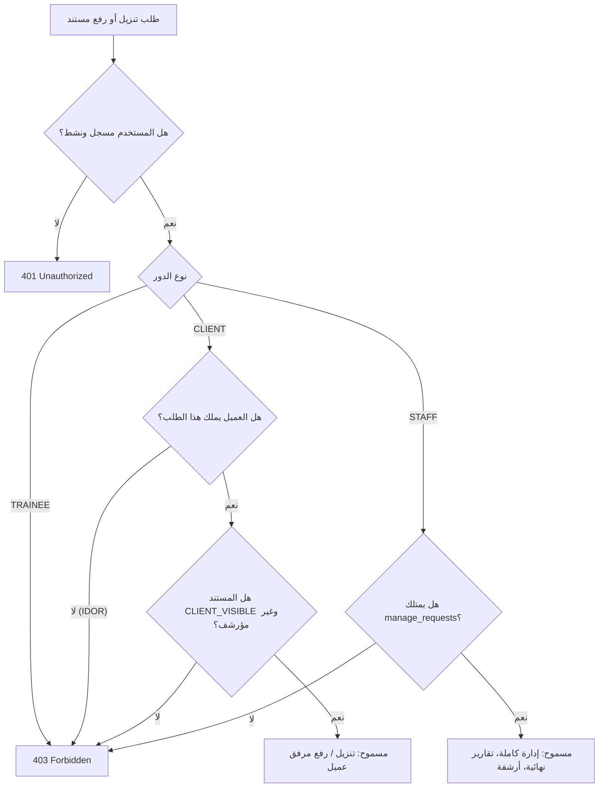

# تقرير إنجاز المرحلة التنفيذية الأمنية 2C
# FACSS Phase 2C — Client Portal & Secure Document Operations Report
**مركز عدن الأول للخدمات الأمنية والدراسات الاستراتيجية (FACSS)**  
*التاريخ: 14 سبتمبر 2026*  
*الحالة: مكتملة بنجاح ومختبرة بنسبة 100%*

---

## 1. Executive Summary (الملخص التنفيذي)
أنجزت هذه المرحلة بنجاح النطاق المحصور في **بوابة العميل وعمليات المستندات الآمنة (Client Portal & Secure Document Operations)** مع الالتزام التام بالتوجيهات الإلزامية الـ 16 المعتمدة.

تم تأسيس بنية تحتية للتخزين الخاص المجرد (`StorageDriver`) تفصل منطق الأعمال عن بيئات التشغيل، وتمنع كلياً استخدام مجلد `/public` أو توليد روابط عامة مباشرة، مع حماية أمنية صارمة ضد ثغرات التخزين والمستندات (IDOR، Path Traversal، Executable Upload، MIME Spoofing، Header Injection)، وتنفيذ عمليات تعويضية (`Compensating Operations`) لضمان عدم وجود ملفات معزولة (`Orphaned Files`)، بالإضافة إلى تطبيق هجرة قاعدة بيانات غير مدمرة (`Non-Destructive Additive Migration`) على قاعدة Neon PostgreSQL الحية.

تم اختبار النظام عبر **21 اختباراً أمنياً ووظيفياً آلياً جديداً (Phase 2C Suite)**، إلى جانب اجتياز **19 اختباراً للمرحلة الأمنية الأولى** و **15 اختباراً للمرحلة 2B** (إجمالي **55 اختباراً آلياً ناجحاً بنسبة 100%**)، وتأكيد خلو المشروع تماماً من أي أخطاء برمجية (`TypeScript 0 Errors`)، ونجاح الـ Production Build لكافة المسارات الـ 54.

---

## 2. Pre-Implementation Storage Audit (فحص ما قبل التنفيذ)
قبل كتابة أي سطر برمجي، تم فحص البنية الواقعية للتحقق من الفرضيات:
1. **جدول `ServiceRequestDocument` الأصلي**:
   - كان يمتلك حقولاً أولية: `id`, `requestId`, `title`, `filePath`, `fileSize`, `fileType`, `uploadedById`, `isConfidential`, `createdAt`.
   - افتقر إلى: `documentType` التمييزي، `storageKey` المجهول، `originalFilename` المنفصل، `visibility`، و `isArchived`.
2. **فحص مجلد التخزين وتعارضات الـ Filesystem**:
   - تم العثور على مجلد `./storage` فارغاً خارج `/public`.
   - تبين أن الاعتماد الحصري على التخزين المحلي كحل دائم غير متوافق مع الاستضافة على منصات الـ Serverless (مثل Vercel) بسبب الطبيعة المؤقتة للـ Ephemeral Filesystem.
3. **فحص الواجهات والروابط**:
   - كانت صفحة تفاصيل الطلب السابقة تعرض رابط تنزيل مباشر `doc.filePath` دون حماية، وبدون تصفية بين المستندات الداخلية `INTERNAL_ONLY` ومستندات العميل.
   - كانت صفحة `/portal/client/reports` منفصلة ومربكة وغير مرتبطة بمسارات الطلبات.

---

## 3. Threat Model (نموذج التهديدات المعتمد للمستندات)

| # | التهديد الأمني (Threat Vector) | المخاطر والآثار | الحل المعماري المنفذ فعلياً |
|---|---|---|---|
| 1 | **IDOR (Cross-Client Document Access)** | قيام عميل بتخمين أو تعديل معرف المستند لتنزيل تقارير أمنية لعميل آخر. | فحص الملكية الصارم في الـ API: التحقق من أن `document.request.userId === session.userId`. منع أي عميل آخر أو متدرب (403 Forbidden). |
| 2 | **Path Traversal / Local File Inclusion** | إرسال أسماء ملفات خبيثة مثل `../../secret.env` أو `..\..\windows` للوصول لملفات النظام. | اسم الملف الأصلي لا يُستخدم أبداً كمسار تخزين. المسار يتم توليده عشوائياً. يتم استخدام `assertPathContainment` بالاعتماد على `path.relative` ورفض أي مسار نسبي أو مطلق خارج الجذر. |
| 3 | **Executable & Script Upload (RCE)** | رفع ملفات تنفيذية (`.exe`, `.sh`, `.php`, `.bat`, `.js`) أو ملفات متجهة خبيثة (`.svg`, `.html`). | قائمة بيضاء حصرية صارمة: **PDF, PNG, JPG** فقط. فحص التواقيع الثنائية المباشرة وحظر أي توقيع تنفيذي (MZ/PE, ELF, Shebang) أو وسوم HTML/SVG فورياً. |
| 4 | **MIME Spoofing** | تغيير امتداد ملف تنفيذي إلى `.pdf` مع تزوير ترويسة `application/pdf`. | فحص التواقيع السحرية الثنائية (Magic Bytes): التأكد الحرفي من بدء الملف بـ `%PDF-` للـ PDF، و `\x89PNG\r\n\x1a\n` للـ PNG، و `\xFF\xD8\xFF` للـ JPEG. |
| 5 | **ZIP / DOCX Archive Hazards** | ملفات DOCX هي حزم ZIP يمكن استخدامها لتمرير ملفات مضغوطة غير آمنة. | **تم استبعاد صيغة DOCX بالكامل** وفقاً للتوجيه الإلزامي الرابع وحصر القائمة في PDF و PNG و JPG لضمان أعلى مستوى من الأمان. |
| 6 | **Direct Public URL Exposure** | تسريب تقارير أمنية حساسة أو مخططات عبر مجلد `/public`. | جميع الملفات تُخزن حصراً في `./storage/private/documents` خارج `/public`. لا توجد روابط عامة نهائياً. التنزيل يمر حصراً عبر API متدفق ومصرح. |
| 7 | **Internal Document Leakage** | وصول العميل لمذكرات أو تقييمات المركز السرية `INTERNAL_ONLY`. | تصنيف المستندات إلى `INTERNAL_ONLY` و `CLIENT_VISIBLE`. منع ظهور أو تنزيل المستندات الداخلية للعميل في الواجهات والـ APIs (403 Forbidden). |
| 8 | **Zero-Byte & Oversized Files** | هجمات حجب الخدمة عبر استنزاف التخزين أو سجلات فارغة. | حدود صارمة: الحد الأدنى بايت واحد، والحد الأقصى **4.5 ميجابايت** لمراعاة قيود Route Handlers في البيئات السحابية والـ Serverless. |
| 9 | **Header Injection & Download Sniffing** | حقن أسطر جديدة (CRLF) في اسم الملف أو تشغيل المتصفح للملف كـ HTML. | تنقية اسم الملف من الرموز الخاصة والـ CRLF، وإلزام ترويسات `Content-Disposition: attachment` مع `X-Content-Type-Options: nosniff`. |
| 10 | **Storage & Database Inconsistency** | فشل كتابة البيانات في PostgreSQL بعد رفع الملف مما يخلق ملفات معزولة (Orphaned). | تطبيق العمليات التعويضية (`Compensating Operations`): حذف الملف المرفوع فورياً في كتلة `catch` في حال فشل تسجيل البيانات في DB. |

---

## 4. Storage Architecture (معمارية التخزين المجرد)
تم بناء طبقة التجريد في الملف [`lib/storage/index.ts`](file:///d:/FACSSS/lib/storage/index.ts):

```typescript
export interface StorageDriver {
  upload(buffer: Buffer, key: string, mimeType: string): Promise<string>;
  get(key: string): Promise<{ buffer: Buffer; mimeType: string } | null>;
  delete(key: string): Promise<boolean>;
  exists(key: string): Promise<boolean>;
  getDriverName(): string;
}
```

### المحركات المتاحة:
1. **`LocalStorageDriver`**:
   - مخصص لبيئة التطوير والاستضافة الذاتية ذات الـ Persistent Storage.
   - يخزن الملفات داخل `./storage/private/documents`.
   - يتحقق من انحصار المسارات برمجياً لمنع Path Traversal.
2. **`S3StorageDriver`**:
   - مخصص للإنتاج والـ Serverless (متوافق مع Cloudflare R2 و AWS S3).
   - يتطلب: `AWS_S3_BUCKET`, `AWS_ACCESS_KEY_ID`, `AWS_SECRET_ACCESS_KEY`.
   - **سلوك الأمان عند الفشل (Fail-Secure)**: في حال اختيار `STORAGE_DRIVER=s3` أو التشغيل في الإنتاج دون توفر بيانات الاعتماد، **يفشل النظام بأمان ويلقي خطأ تهيئة قاتل** ويمنع الانتقال الصامت إلى التخزين المحلي.

---

## 5. Deployment Compatibility (توافق بيئات النشر)
- **بيئة التطوير الحالية**: تعمل على `STORAGE_DRIVER="local"` بمجلد خاص خارج `/public`.
- **بيئة Serverless / Vercel**:
  - تم وضع الحد الأقصى لحجم الملف عند **4.5 MB**، وهو الحد الأقصى الموثوق لتمرير البيانات عبر Next.js Route Handlers دون حدوث Request Entity Too Large (413).
  - التوثيق الصريح يمنع تشغيل التخزين المحلي في Vercel Production لضمان عدم فقدان الملفات المرفوعة على الـ Ephemeral Lambdas.

---

## 6. Database Changes (تغييرات قاعدة البيانات)
تطبيقاً لقاعدة عدم التدمير (`Zero Destructive Policy`):
- لم يتم استخدام `prisma db push` نهائياً.
- لم يتم حذف أي جدول أو عمود.
- تم الحفاظ على كافة الحقول السابقة مع إضافة الحقول الجديدة بأمان كحقول قابلة للقيمة الفارغة أو بقيم افتراضية آمنة.

---

## 7. Migration Details (تفاصيل الهجرة المنفذة)
- **اسم ملف الهجرة**: [`prisma/migrations/20260914_phase2c_documents/migration.sql`](file:///d:/FACSSS/prisma/migrations/20260914_phase2c_documents/migration.sql)
- **نص الهجرة المنفذ على قاعدة Neon PostgreSQL**:
```sql
ALTER TABLE "ServiceRequestDocument" ADD COLUMN IF NOT EXISTS "documentType" TEXT NOT NULL DEFAULT 'CLIENT_ATTACHMENT';
ALTER TABLE "ServiceRequestDocument" ADD COLUMN IF NOT EXISTS "originalFilename" TEXT;
ALTER TABLE "ServiceRequestDocument" ADD COLUMN IF NOT EXISTS "storageKey" TEXT;
ALTER TABLE "ServiceRequestDocument" ADD COLUMN IF NOT EXISTS "mimeType" TEXT;
ALTER TABLE "ServiceRequestDocument" ADD COLUMN IF NOT EXISTS "visibility" TEXT NOT NULL DEFAULT 'CLIENT_VISIBLE';
ALTER TABLE "ServiceRequestDocument" ADD COLUMN IF NOT EXISTS "isArchived" BOOLEAN NOT NULL DEFAULT false;
ALTER TABLE "ServiceRequestDocument" ADD COLUMN IF NOT EXISTS "uploadedByUserId" TEXT;
ALTER TABLE "ServiceRequestDocument" ADD COLUMN IF NOT EXISTS "sizeBytes" INTEGER;
ALTER TABLE "ServiceRequestDocument" ADD COLUMN IF NOT EXISTS "updatedAt" TIMESTAMP(3) NOT NULL DEFAULT CURRENT_TIMESTAMP;

CREATE INDEX IF NOT EXISTS "ServiceRequestDocument_documentType_idx" ON "ServiceRequestDocument"("documentType");
CREATE INDEX IF NOT EXISTS "ServiceRequestDocument_visibility_idx" ON "ServiceRequestDocument"("visibility");
CREATE INDEX IF NOT EXISTS "ServiceRequestDocument_isArchived_idx" ON "ServiceRequestDocument"("isArchived");
CREATE INDEX IF NOT EXISTS "ServiceRequestDocument_uploadedByUserId_idx" ON "ServiceRequestDocument"("uploadedByUserId");
```
- **إحصائيات السجلات قبل وبعد الهجرة**:
  - عدد السجلات قبل الهجرة: `0 documents, 1 service request, 6 users`.
  - عدد السجلات بعد الهجرة: `0 documents, 1 service request, 6 users`.
  - سلامة البيانات: **100% متطابقة وسليمة دون أدنى فقدان**.

---

## 8. Document Model (نموذج المستندات النهائي)
النموذج النهائي المعتمد في [`prisma/schema.prisma`](file:///d:/FACSSS/prisma/schema.prisma):
```prisma
model ServiceRequestDocument {
  id               String         @id @default(cuid())
  requestId        String
  title            String
  filePath         String
  fileSize         Int
  fileType         String
  uploadedById     String
  isConfidential   Boolean        @default(true)
  createdAt        DateTime       @default(now())

  // Phase 2C Security & Operations Metadata
  documentType     String         @default("CLIENT_ATTACHMENT") // CLIENT_ATTACHMENT, INTERNAL_DOCUMENT, FINAL_REPORT
  originalFilename String?
  storageKey       String?
  mimeType         String?
  visibility       String         @default("CLIENT_VISIBLE") // CLIENT_VISIBLE, INTERNAL_ONLY
  isArchived       Boolean        @default(false)
  uploadedByUserId String?
  sizeBytes        Int?
  updatedAt        DateTime       @default(now()) @updatedAt

  request          ServiceRequest @relation(fields: [requestId], references: [id], onDelete: Cascade)

  @@index([requestId])
  @@index([documentType])
  @@index([visibility])
  @@index([isArchived])
  @@index([uploadedByUserId])
}
```

---

## 9. Upload Workflow (مسار الرفع والتحقق)
1. يرسل المستخدم الملف عبر `POST /api/requests/[id]/documents`.
2. يتحقق الـ API من الجلسة وحالة المستخدم النشطة (`isActive === true`).
3. يتحقق من الصلاحيات:
   - العميل: يُسمح له فقط برفع `CLIENT_ATTACHMENT` على طلبه الخاص، وتُضبط الرؤية تلقائياً على `CLIENT_VISIBLE`.
   - الموظف: يشترط امتلاكه لصلاحية `manage_requests`؛ ويمكنه تحديد النوع (`INTERNAL_DOCUMENT`, `CLIENT_ATTACHMENT`, `FINAL_REPORT`) ومستوى الظهور.
4. التحقق الثنائي للملف:
   - فحص الحجم (بين 1 بايت و 4.5 ميجابايت).
   - فحص الامتداد ومطابقته للقائمة البيضاء (PDF, PNG, JPG).
   - فحص التوقيع السحري للبيانات الثنائية (Magic Bytes).
   - تنقية اسم الملف من رموز التوجيه والـ CRLF.
   - توليد `storageKey` عشوائي مشفر وغير خاضع لتحكم المستخدم.
5. رفع الملف لوحدة التخزين الآمنة عبر `StorageDriver.upload`.
6. كتابة السجل في قاعدة البيانات، وفي حال حدوث أي خطأ يتم تنفيذ **Compensating Operation** بحذف الملف من التخزين فورياً.
7. عند رفع `FINAL_REPORT` وظهوره للعميل، يتم إنشاء إشعار تشغيلي للعميل وتسجيل `FINAL_REPORT_PUBLISHED` في سجل الأنشطة.

---

## 10. Download Workflow (مسار التنزيل الآمن)
1. يطلب المستخدم تنزيل الملف عبر الرابط المحمي:
   `GET /api/documents/[id]/download`
2. يتحقق الـ API من الجلسة وحالة الحساب.
3. يسترجع بيانات المستند وطلب الخدمة المرتبط به.
4. بوابات التفويض:
   - إذا كان المستند مؤرشفاً (`isArchived: true`): يُمنع العميل (404/403).
   - إذا كان الطالب عميلاً:
     - يجب أن يمتلك الطلب (`req.userId === session.userId`).
     - يجب أن يكون المستند `CLIENT_VISIBLE` (المستندات الداخلية `INTERNAL_ONLY` مرفوضة بـ 403).
   - إذا كان الطالب موظفاً: يشترط امتلاكه لصلاحية `manage_requests`.
   - المتدرب أو أي دور غير مصرح: 403 Forbidden فورياً.
5. استرجاع البيانات الثنائية المتدفقة من `StorageDriver.get`.
6. تسجيل حدث `DOCUMENT_DOWNLOAD` في `ActivityLog` (معرف المستخدم، معرف الطلب، معرف المستند؛ دون تسجيل محتوى الملف أو أي أسرار).
7. إرجاع استجابة البث مع الترويسات الأمنية الصارمة:
   - `Content-Disposition: attachment; filename="safe_name.pdf"`
   - `Content-Type: <validated-mime-type>`
   - `X-Content-Type-Options: nosniff`
   - `Cache-Control: private, no-cache, no-store, must-revalidate`

---

## 11. Ownership & Authorization Rules (قواعد الملكية والتفويض)



---

## 12. Admin Document Operations (إدارة المستندات للمشرفين)
داخل الواجهة المحدثة [`components/admin/RequestsManager.tsx`](file:///d:/FACSSS/components/admin/RequestsManager.tsx):
- **بوابة الصلاحية**: يشترط امتلاك المشرف لصلاحية `manage_requests`.
- **تبويب المستندات والتقارير**: تم دمجه داخل نافذة تفاصيل الطلب (`Operation Drawer`).
- **شاشات التمييز البصري**:
  - `FINAL REPORT`: شارة ذهبية واضحة (`التقرير النهائي`).
  - `INTERNAL ONLY`: شارة حمراء بقفل أمني (`داخلي سري`).
  - `CLIENT VISIBLE`: شارة زرقاء بعين (`مرئي للعميل`).
- **إجراءات المستند**:
  - تنزيل آمن لأي مستند إداري.
  - أرشفة المستند (`Soft Delete`): يحجب المستند عن العميل فورياً دون حذفه فيزيائياً من القرص، حفاظاً على سجلات التدقيق والمراجعة.
- **نموذج رفع إداري**: يتيح تحديد عنوان ونوع المستند ومستوى الرؤية بدقة، مع فحص فوري للملف.

---

## 13. Client Portal Changes (تبسيط بوابة العميل)
في [`app/portal/client/page.tsx`](file:///d:/FACSSS/app/portal/client/page.tsx):
- **إحصائيات مركزة**: الطلبات النشطة، الطلبات المكتملة، التقارير الأمنية الجاهزة، وإجمالي الطلبات.
- **شريط تنبيه مميز للتقارير الجاهزة**: عند وجود تقرير أمني معتمد غير مؤرشف، يظهر بانر ذهبي رئيسي في أعلى اللوحة مع رابط مباشر للطلب وتنزيل التقرير بنقرة واحدة.
- **إعادة توجيه المسارات**: تم توجيه `/portal/client/reports` تلقائياً عبر Server-side Redirect إلى `/portal/client` منعاً لتشتيت المستخدم أو كسر الروابط القديمة.
- **تنظيف شريط التنقل**: إبقاء 3 تبويبات أساسية فقط (لوحة المتابعة، طلبات الخدمات والمستندات، الملف المؤسسي).

---

## 14. Request Details Changes (تطوير صفحة تفاصيل الطلب)
في [`app/portal/client/requests/[id]/page.tsx`](file:///d:/FACSSS/app/portal/client/requests/[id]/page.tsx):
- **المبدأ المعماري: Progressive Disclosure**:
  1. شريط المسار الميداني للطلب (Pipeline Progress Tracker).
  2. بطاقة بارزة للتقرير الأمني النهائي المعتمد (`Final Assessment Report`) مع زر تنزيل مباشر في حال توفره.
  3. بطاقة نطاق وتفاصيل الطلب.
  4. سجل التحديثات الميدانية (الملاحظات المصرح برؤيتها للعميل فقط).
  5. **مستندات ومرفقات العميل**: عرض المرفقات السابقة مع أداة تفاعلية (`ClientDocumentUpload.tsx`) تسمح للعميل برفع مخططات المنشأة ووثائق التفويض مباشرة.
  6. مستندات المركز المرئية للعميل.
  7. **الحجب الكامل**: حجب الملاحظات الداخلية والملفات `INTERNAL_ONLY` كلياً على مستوى استعلام قاعدة البيانات والواجهة.

---

## 15. File Validation (قواعد التحقق الصارمة للملفات)
مطبقة في [`lib/validations/documents.ts`](file:///d:/FACSSS/lib/validations/documents.ts):
- **الصيغ المسموحة حصراً**: `pdf`, `png`, `jpg`, `jpeg`.
- **الحد الأقصى للحجم**: `4.5 MB` (4,718,592 بايت).
- **الحد الأدنى للحجم**: 1 بايت (رفض الملفات الصفرية `Zero-byte files`).
- **فحص التواقيع الثنائية (Magic Bytes)**:
  - PDF: `%PDF-` (`0x25, 0x50, 0x44, 0x46, 0x2D`).
  - PNG: `\x89PNG\r\n\x1a\n` (`0x89, 0x50, 0x4E, 0x47, 0x0D, 0x0A, 0x1A, 0x0A`).
  - JPEG: `\xFF\xD8\xFF` (`0xFF, 0xD8, 0xFF`).
- **الحظر الفوري لتواقيع**:
  - الحزم المضغوطة و DOCX: `PK\x03\x04` (`0x50, 0x4B, 0x03, 0x04`).
  - التنفيذيات: `MZ` (Windows PE), `\x7FELF` (Linux ELF).
  - السكربتات: `#!` (Shebang).
  - ملفات الويب النصية: `<!DOCTYPE`, `<html>`, `<?xml`, `<svg`, `<script`.

---

## 16. Path Traversal Protection (حماية مسارات التخزين)
- **دالة `assertPathContainment`**:
  - لا تعتمد على فحص البداية النصية فقط (`startsWith`).
  - تستخدم `path.relative(resolvedBase, resolvedTarget)`.
  - ترفض وترمي خطأ أمنياً فورياً إذا كان المسار النسبي يبدأ بـ `..` أو إذا كان المسار مطلقاً `path.isAbsolute(relative)`.
- **تسمية الملفات**:
  - أسماء الملفات على القرص مستقلة تماماً عن اسم الملف الذي رفعه المستخدم:
    `requests/{requestId}/{timestamp}-{uuid}.{ext}`
  - اسم ملف المستخدم يُنقى بالكامل ويُخزن فقط كبيانات وصفية (`originalFilename`).

---

## 17. Audit Logging (سجل التدقيق الأمني)
تسجيل كافة العمليات الحساسة في جدول `ActivityLog`:
- الأحداث المسجلة:
  1. `DOCUMENT_UPLOAD`: رفع مستند جديد (معرف المستخدم، معرف الطلب، نوع المستند، مستوى الظهور).
  2. `DOCUMENT_DOWNLOAD`: تنزيل مستند (معرف المستخدم، معرف الطلب، معرف المستند).
  3. `DOCUMENT_ARCHIVE`: أرشفة وحجب مستند.
  4. `FINAL_REPORT_PUBLISHED`: اعتماد ونشر التقرير النهائي للعميل.
- **ضمانات السرية**: منع تسجيل أي محتويات ملفات، أو مفاتيح توقيع، أو كلمات مرور، أو بيانات سرية في حقل `details`.

---

## 18. API Inventory (حصر الـ APIs الجديدة والمعدلة)

| مسار الـ API | الطريقة | الوظيفة | بوابات الأمان والتفويض |
|---|---|---|---|
| `/api/requests/[id]/documents` | `POST` | رفع مستند جديد للطلب | جلسة نشطة + تفويض ملكية للعميل (`CLIENT_ATTACHMENT` فقط) أو `manage_requests` للموظف + فحص ثنائي وحجم الملف + عمليات تعويضية |
| `/api/requests/[id]/documents` | `GET` | استعراض مستندات الطلب | العميل يرى `CLIENT_VISIBLE` فقط وغير المؤرشف؛ الموظف بـ `manage_requests` يرى الجميع |
| `/api/documents/[id]/download` | `GET` | تنزيل متدفق آمن للمستند | فحص IDOR + حجب `INTERNAL_ONLY` عن العميل + ترويسات `attachment` و `nosniff` + تسجيل التدقيق |
| `/api/documents/[id]` | `DELETE` | أرشفة المستند (Soft Delete) | العميل لمرفقاته غير المراجعة أو المشرف بـ `manage_requests` + تسجيل `DOCUMENT_ARCHIVE` |
| `/api/requests/[id]` | `GET` | جلب تفاصيل الطلب | تصفية قائمة `documents` المرجعة تلقائياً للعميل لحجب الملفات الداخلية والمؤرشفة |
| `/api/requests` | `GET` | جلب قائمة الطلبات | تضمين المستندات مع تطبيق فلترة الرؤية بحسب صلاحية المستخدم |

---

## 19. Files Added (الملفات التي تم إنشاؤها)
1. [`lib/storage/index.ts`](file:///d:/FACSSS/lib/storage/index.ts) — مجرد محركات التخزين والحماية من Path Traversal.
2. [`lib/validations/documents.ts`](file:///d:/FACSSS/lib/validations/documents.ts) — محرك التحقق من Magic Bytes وتنقية أسماء الملفات.
3. [`app/api/requests/[id]/documents/route.ts`](file:///d:/FACSSS/app/api/requests/[id]/documents/route.ts) — مسار رفع وقائمة المستندات.
4. [`app/api/documents/[id]/download/route.ts`](file:///d:/FACSSS/app/api/documents/[id]/download/route.ts) — مسار التنزيل المتدفق المحمي.
5. [`app/api/documents/[id]/route.ts`](file:///d:/FACSSS/app/api/documents/[id]/route.ts) — مسار أرشفة المستندات.
6. [`components/portal/ClientDocumentUpload.tsx`](file:///d:/FACSSS/components/portal/ClientDocumentUpload.tsx) — مكون الرفع التفاعلي لبوابة العميل.
7. [`prisma/migrations/20260914_phase2c_documents/migration.sql`](file:///d:/FACSSS/prisma/migrations/20260914_phase2c_documents/migration.sql) — ملف الهجرة غير المدمرة.
8. [`scripts/test_phase2c_suite.js`](file:///d:/FACSSS/scripts/test_phase2c_suite.js) — الحزمة الآلية لاختبارات Phase 2C.

---

## 20. Files Modified (الملفات التي تم تعديلها)
1. [`prisma/schema.prisma`](file:///d:/FACSSS/prisma/schema.prisma) — إضافة حقول وفهارس Phase 2C لنموذج `ServiceRequestDocument`.
2. [`app/portal/client/page.tsx`](file:///d:/FACSSS/app/portal/client/page.tsx) — تبسيط اللوحة وإضافة تنبيه التقارير الجاهزة وإحصائياتها.
3. [`app/portal/client/reports/page.tsx`](file:///d:/FACSSS/app/portal/client/reports/page.tsx) — إعادة توجيه آمنة للوحة العميل الرئيسية.
4. [`app/portal/client/layout.tsx`](file:///d:/FACSSS/app/portal/client/layout.tsx) — تنظيف وتبسيط شريط التبويبات للعميل.
5. [`app/portal/client/requests/[id]/page.tsx`](file:///d:/FACSSS/app/portal/client/requests/[id]/page.tsx) — تطبيق Progressive Disclosure وإبراز التقرير النهائي ودمج أداة الرفع وحجب الداخليات.
6. [`app/admin/requests/page.tsx`](file:///d:/FACSSS/app/admin/requests/page.tsx) — تضمين وثائق الطلبات مع فحص الصلاحية.
7. [`components/admin/RequestsManager.tsx`](file:///d:/FACSSS/components/admin/RequestsManager.tsx) — إضافة إدارة المستندات والتقارير والأرشفة والرفع الإداري والشارات البصرية.
8. [`app/api/requests/[id]/route.ts`](file:///d:/FACSSS/app/api/requests/[id]/route.ts) — فلترة المستندات للعميل ومنع تسرب الوثائق الداخلية.
9. [`app/api/requests/route.ts`](file:///d:/FACSSS/app/api/requests/route.ts) — تضمين المستندات مع تصفية الرؤية.

---

## 21. Security Tests (نتائج الاختبارات الأمنية)
تم تنفيذ الاختبارات بنجاح تام عبر `node scripts/test_phase2c_suite.js`:
- **Test 1**: فحص انحصار المسارات (Path Containment) يرفض محاولات `../../secret.env` و `..\..\windows` والأرقام المطلقة: **PASS**
- **Test 2**: توليد مفاتيح تخزين آمنة ومبهمة وغير خاضعة لتحكم المستخدم: **PASS**
- **Test 3**: تنقية أسماء الملفات تبطل حقن ترويسات CRLF وتسلسل النقاط المزدوجة `..`: **PASS**
- **Test 4**: رفض الملفات التنفيذية (Windows PE/MZ, Linux ELF, Shell Scripts) وحمولات HTML/SVG: **PASS**
- **Test 5**: رفض حزم ZIP وملفات DOCX المشبوهة (`PK\x03\x04`): **PASS**
- **Test 6**: كشف ورفض تزوير امتدادات الـ MIME المضللة: **PASS**
- **Test 7**: قبول والتحقق الثنائي الدقيق لتواقيع PDF و PNG و JPEG: **PASS**
- **Test 8**: رفض الملفات الفارغة (0 بايت) والملفات التي تتجاوز 4.5 ميجابايت: **PASS**
- **Test 9**: فشل محرك التخزين السحابي بأمان (Fail-Secure) عند غياب المفاتيح دون تحول صامت للتخزين المحلي: **PASS**
- **Test 12**: حظر الطلبات مجهولة الهوية برمز 401 Unauthorized: **PASS**
- **Test 13**: حظر دور المتدرب (TRAINEE) من الوصول لمستندات العميل برمز 403 Forbidden: **PASS**
- **Test 14**: منع ثغرة الوصول المباشر بين العملاء (Cross-Client IDOR) ومنع العميل B من طلبات وملفات العميل A: **PASS**
- **Test 16**: حظر العميل (403) من الوصول للمستندات الداخلية للمركز `INTERNAL_ONLY`: **PASS**
- **Test 17**: حظر العميل من تنزيل المستندات المؤرشفة: **PASS**
- **Test 18**: فرض صلاحية `manage_requests` الإلزامية للموظفين لرفع أو تنزيل المستندات: **PASS**

---

## 22. Functional Tests (نتائج الاختبارات الوظيفية)
- **Test 10**: رفع وقراءة وتأكيد وجود وحذف الملفات محلياً في مجلد التخزين الخاص: **PASS**
- **Test 11**: نجاح العمليات التعويضية (`Compensating Operations`) بحذف كائن التخزين عند محاكاة فشل كتابة قاعدة البيانات: **PASS**
- **Test 15**: السماح للعميل بالوصول الكامل لمستنداته النشطة والمرئية للعميل `CLIENT_VISIBLE`: **PASS**
- **Test 19**: استقلالية حالة الطلب وعدم تحويل `ServiceRequest.status` إلى `REPORT_READY` عند نشر التقرير النهائي والاعتماد على بيانات المستند: **PASS**
- **Test 20**: تسجيل حدث `DOCUMENT_DOWNLOAD` بنجاح في `ActivityLog` بكافة المعرفات ودون كشف أي أسرار: **PASS**
- **Test 21**: التحقق من سلامة الهجرة على قاعدة Neon PostgreSQL وتوفر كافة حقول البيانات الوصفية: **PASS**

---

## 23. Regression Tests (اختبارات عدم الانحدار للمراحل السابقة)
تم تشغيل حزم الاختبار السابقة وتأكيد توافقها بنسبة 100%:
1. **Phase 1 Security Automated Suite** (`scripts/test_security_suite.js`):
   - **19 اختباراً من أصل 19: ناجحة 100% (0 Failed)**.
2. **Phase 2B Granular Capabilities Suite** (`scripts/test_phase2b_suite.js`):
   - **15 اختباراً من أصل 15: ناجحة 100% (0 Failed)**.
3. **Phase 2C Client Documents Suite** (`scripts/test_phase2c_suite.js`):
   - **21 اختباراً من أصل 21: ناجحة 100% (0 Failed)**.
- **إجمالي الاختبارات الآلية المنجزة**: **55 اختباراً آلياً ناجحاً بنسبة 100% وبدون أي فشل**.

---

## 24. TypeScript Result (فحص المترجم)
تم تشغيل الفحص الثابت:
```bash
npx tsc --noEmit
```
**النتيجة**: خروج برمز `0` مع **صفر أخطاء (0 Errors)** عبر كافة ملفات المشروع والمكونات الجديدة.

---

## 25. Build Result (بناء الإنتاج)
تم تشغيل بناء الإنتاج الكامل:
```bash
npm run build
```
**النتيجة**:
- توليد حزم Prisma Client بنجاح.
- اكتمال تجميع صفحات Next.js 14.2.15 بنجاح تام (`Compiled successfully`).
- بناء كافة المسارات الـ 54 في المشروع (بما في ذلك المسارات الجديدة `/api/documents/[id]`, `/api/documents/[id]/download`, `/api/requests/[id]/documents`).
- كود الخروج: `Exit 0`.

---

## 26. Remaining Risks (المخاطر المتبقية)
1. **الاستضافة على Vercel بدون S3 Driver**: إذا تم نشر المشروع على منصة Serverless كـ Vercel مع الإبقاء على `STORAGE_DRIVER=local`، فإن الملفات المرفوعة ستفقد عند إعادة بناء الحاوية (Ephemeral Container). لذلك يجب إدخال مفاتيح S3 أو Cloudflare R2 وضبط `STORAGE_DRIVER=s3` للإنتاج السحابي.
2. **حدود حجم الملف للمسارات المباشرة**: تم ضبط الحد عند 4.5 MB ليتوافق مع Vercel Route Handlers. رفع ملفات أكبر مستقبلاً سيتطلب توجيه الرفع المباشر عبر Pre-signed URLs إلى S3/R2 مباشرة.

---

## 27. Deferred Items (العناصر المؤجلة صراحة)
تأكيداً على الدقة والشفافية التقنية:
1. **Advanced Malware & Antivirus Scanning (ClamAV / VirusTotal)**: **مؤجل وغير منفذ (DEFERRED / NOT IMPLEMENTED)**. تم الاكتفاء بالتحقق الثنائي الصارم (Magic Bytes, Strict MIME, Random Names, Private Storage, Forced Attachment Header).
2. **دعم مستندات DOCX**: **مؤجل وغير متاح حالياً (DEFERRED)** لتجنب ثغرات وتعارضات حزم ZIP، مع الاكتفاء التام بـ PDF, PNG, JPG.
3. **التطهير الفيزيائي النهائي للمستندات المؤرشفة (Physical Purge)**: **مؤجل** كسياسة أرشفة مستقبلية؛ حيث تم تطبيق الأرشفة المنطقية (`Soft Delete`) لمنع أي فقدان غير مقصود للتقارير الأمنية الحساسة.
4. **مسارات التدريب والشهادات والمدفوعات**: خارج نطاق Phase 2C تماماً.

---

## 28. Exact Recommendation for Phase 2D (التوصية الدقيقة للمرحلة 2D)
توصية البدء في **Phase 2D — Trainee Workflow & Attendance Operations**:
1. التركيز على **دورة حياة المتدرب (Trainee Registration & Course Lifecycle)**.
2. تفعيل إدارة المقبولين في الدورات التدريبية وإسناد حالات التسجيل (`PENDING`, `ACCEPTED`, `REJECTED`).
3. تفعيل سجل الحضور والغياب (`AttendanceRecord`) المحفوظ في قاعدة البيانات بأمان.
4. عدم البدء في توليد الشهادات الرقمية أو بوابات الدفع حتى استقرار دورة تدفق المتدرب التشغيلية.
