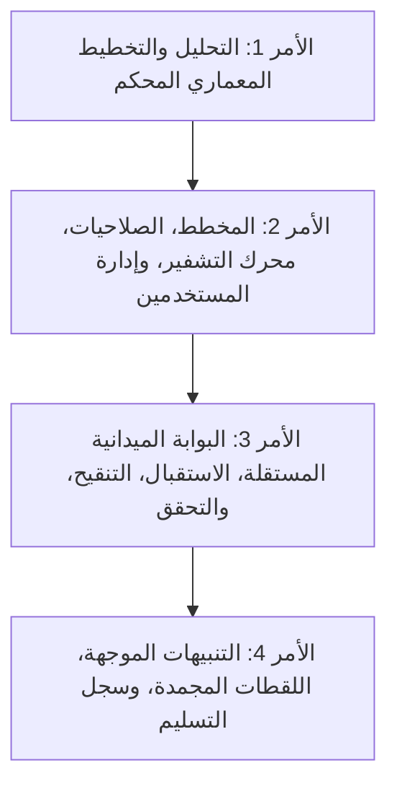

# المخطط المعماري والتنفيذي لمنظومة البلاغات الميدانية والتحقق والتنبيهات
## المرحلة الثانية — الأمر 1 من 4: وثيقة التحليل والتأسيس والتخطيط المعماري (النسخة 3.0 المعتمدة والمصححة)

---

### بيانات الوثيقة وهيدر الاعتماد

| البند | التفاصيل المعتمدة |
| :--- | :--- |
| **اسم المنصة** | منصة مركز عدن الدولي للسلامة والدراسات الميدانية (`FACSS Platform`) |
| **المسار المحلي** | `D:\FACSSS` |
| **الهوية المؤسسية** | **مركز عدن الدولي للسلامة والدراسات الميدانية**<br>*Aden International Center for Safety and Field Assessment* |
| **رقم الإصدار** | **النسخة 3.0 المحكمة والمطابقة برمجياً** (Fully Harmonized Architectural Blueprint) |
| **طبيعة الأمر** | **تحليل وتخطيط وتأسيس معماري حصراً** (Analysis & Architecture Blueprint Only) |
| **القيود التشغيلية الصارمة** | **ممنوع تعديل الكود البرمجي، أو مخطط Prisma، أو قاعدة البيانات، أو الحسابات، أو الصلاحيات، وممنوع تشغيل ترحيلات أو إرسال أي تنبيهات حقيقية.** |
| **حالة الاعتماد** | منقحة ومغلقة وفق النقاط الأربع الإلزامية لصاحب المشروع، وبانتظار الموافقة الصريحة للانتقال إلى الأمر التنفيذي الثاني. |

---

## 1. فحص أدوار النظام وتصميم حساب نقطة الاتصال الميدانية

### أ. فحص الوضع الفعلي للأدوار والمصادقة في الكود القائم
أثبت الفحص الفعلي للكود والمخططات الآتي:
1. **مخطط الأدوار (`prisma/schema.prisma` السطور 13-24):**
   - يحتوي `enum Role` حالياً على 10 أدوار: `SUPER_ADMIN`, `ADMIN`, `STAFF`, `CONTENT_MANAGER`, `SERVICE_MANAGER`, `TRAINING_MANAGER`, `RESEARCH_MANAGER`, `EMPLOYEE`, `CLIENT`, `TRAINEE`.
   - لا يوجد دور مخصص لنقاط الاتصال الميدانية.
2. **بوابة التحقق الوسيطة (`middleware.ts` السطور 7-16):**
   - تُعرف مصفوفة `STAFF_ROLES` وتتضمن: `SUPER_ADMIN`, `ADMIN`, `STAFF`, `CONTENT_MANAGER`, `SERVICE_MANAGER`, `TRAINING_MANAGER`, `RESEARCH_MANAGER`, بالإضافة إلى `EMPLOYEE`.
   - السطور 42-56 تفرض حظر مسار `/admin/:path*` على أي رتبة خارج مصفوفة `STAFF_ROLES`.
   - **الخلل الأمني المكتشف في التصميم السابق:** إذا تم إعطاء نقطة الاتصال رتبة `EMPLOYEE` لتفادي `STAFF` أو `ADMIN`، فإنها ستمر حتماً عبر بوابة `STAFF_ROLES` في `middleware.ts` مما يتيح لها محاولة الوصول إلى مسارات `/admin`.

---

### ب. التصميم البرمجي المعتمد لنقطة الاتصال الميدانية (Isolated Field Focal Point Role)
لضمان العزل التام والمطلق لنقاط الاتصال الميدانية عن أي مسار إداري:
1. **إضافة رتبة مخصصة مستقلة في قاعدة البيانات:**
   - تحديث `enum Role` في `prisma/schema.prisma` بإضافة الدور: `FIELD_FOCAL_POINT`.
   - لا يُمنح مستخدم نقطة الاتصال أي دور إداري (`STAFF`, `ADMIN`, `EMPLOYEE`).
2. **الأثر البرمجي المترتب على مكونات المنظومة:**

| المكوّن | الأثر والتعديل البرمجي الصريح |
| :--- | :--- |
| **Prisma Schema** | إضافة `FIELD_FOCAL_POINT` إلى `enum Role` في نموذج المستخدم `User`. |
| **جلسات المصادقة (`lib/auth.ts`)** | استيعاب الدور الجديد ضمن واجهة `TokenPayload { userId, role, ... }` دون أي كشف لصلاحيات إدارية. |
| **بوابة التحقق (`middleware.ts`)** | 1. **استبعاد `FIELD_FOCAL_POINT` نهائياً من مصفوفة `STAFF_ROLES`:** مما يجعل أي محاولة لدخول `/admin` تُحظر تلقائياً على مستوى Edge وتُرد بـ `403 Forbidden` أو إعادة توجيه.<br>2. **تأمين مسار البوابة الميدانية المستقلة:** إضافة فاحص خاص لمسار `/portal/field/:path*` يتأكد من وجود جلسة صالحة وأن الدور إما `FIELD_FOCAL_POINT` أو `SUPER_ADMIN` أو موظف يحمل صلاحية تقديم. |
| **محرك الصلاحيات (`lib/rbac.ts`)** | 1. `isStaffRole('FIELD_FOCAL_POINT')` تعيد `false` حتماً.<br>2. في `getUserCapabilities`: نقطة الاتصال لا ترث أي قدرة إدارية، ويقتصر ما تملكه على ما يُسند إليها صراحة في جدول `UserCapability` (وهو كود `submit_incident` فقط). |
| **واجهة البوابة الميدانية** | تخصيص مسار مستقل وخفيف `/portal/field/intake` خالي من أي قوائم إدارية، ومصمم للتجاوب السريع مع شبكات الجوال الميدانية الضعيفة. |
| **حزمة الاختبارات** | اختبار محاولة جلسة `FIELD_FOCAL_POINT` دخول `/admin` والتأكد من صدها بـ `403 / redirect`، مع نجاح دخولها للبوابة الميدانية وتقديم البلاغ في الأمر 3. |

---

## 2. توحيد مصفوفة الصلاحيات وقاعدة الاستحقاق الثلاثي لحماية البيانات

### أ. قاعدة الاستحقاق الثلاثي الصارمة للاطلاع على النسخ المنقحة
- **لا تكفي رتبة `ADMIN` ولا رتبة `STAFF` العامة للاطلاع على النسخ المنقحة للبلاغات**.
- يُشترط لقراءة النسخة المنقحة (`IncidentRedacted`) توفر **شروط الاستحقاق الثلاثي المتزامنة**:
  1. **حساب نشط ومفعل:** `User.isActive === true`.
  2. **صلاحية وظيفية صريحة:** حيازة كود `verify_incident` أو `analyze_incident` في جدول `UserCapability`.
  3. **إسناد وظيفي نشط للبلاغ نفسه:** وجود سجل نشط في جدول `IncidentAssignment` يربط المستخدم بالبلاغ المعني (`isActive === true` و `revokedAt === null`).
- في حال عدم توافر أي شرط من الشروط الثلاثة، يُحرم المستخدم فوراً وخادمياً من قراءة تفاصيل البلاغ ويُرد برمز `403 Forbidden`.

---

### ب. قصر الأصل الحساس على المدير الأعلى حصراً
- أصل البلاغ الحساس (`IncidentOriginal`) مخصص **حصراً واستثنائياً** للمدير الأعلى (`SUPER_ADMIN`).
- يُحظر اطلاع أي مستخدم آخر عليه، حتى وإن حمل رتبة `ADMIN` أو كان الموظف المكلف بالتحقق أو المحلل الرئيس للحدث.

---

### ج. مصفوفة الصلاحيات الموحدة المعتمدة

| العملية التشغيلية | المدير الأعلى (`SUPER_ADMIN`) | مدير النظام (`ADMIN`) | موظف مكلف بالبلاغ نشطاً (`Assigned Staff`) | موظف غير مكلف بالبلاغ (`Unassigned Staff`) | نقطة اتصال ميدانية (`FIELD_FOCAL_POINT`) | العميل المؤسسي (`CLIENT`) | المتدرب والزائر (`TRAINEE` / `VISITOR`) |
| :--- | :---: | :---: | :---: | :---: | :---: | :---: | :---: |
| **الوصول للبوابة الميدانية المستقلة** | مسموح | ممنوع | مسموح (إذا ملك الصلاحية) | مسموح (إذا ملك الصلاحية) | **مسموح (حصراً)** | **ممنوع قطعاً** | **ممنوع قطعاً** |
| **تقديم بلاغ ميداني جديد** | مسموح | ممنوع | مسموح (إذا ملك الصلاحية) | مسموح (إذا ملك الصلاحية) | **مسموح (حصراً)** | **ممنوع قطعاً** | **ممنوع قطعاً** |
| **دخول مسارات لوحة الإدارة (`/admin`)** | **مسموح** | **مسموح** | **مسموح** | **مسموح** | **ممنوع قطعاً (حظر 403)** | **ممنوع قطعاً** | **ممنوع قطعاً** |
| **قراءة أصل البلاغ الحساس (`Original`)** | **مسموح حصراً** | **ممنوع قطعاً** | **ممنوع قطعاً** | **ممنوع قطعاً** | **ممنوع قطعاً** | **ممنوع قطعاً** | **ممنوع قطعاً** |
| **قراءة النسخة المنقحة (`Redacted`)** | **مسموح** | **ممنوع\*** | **مسموح (بالاستحقاق الثلاثي)** | **ممنوع قطعاً (حظر 403)** | **ممنوع قطعاً** | **ممنوع قطعاً** | **ممنوع قطعاً** |
| **إنشاء واعتماد النسخة المنقحة** | **مسموح حصراً** | ممنوع | ممنوع | ممنوع | ممنوع | ممنوع قطعاً | ممنوع قطعاً |
| **إسناد المهمة أو سحبها** | **مسموح حصراً** | ممنوع | ممنوع | ممنوع | ممنوع | ممنوع قطعاً | ممنوع قطعاً |
| **توثيق التحقق بمعيار أدميرالتي** | مسموح | ممنوع | **مسموح (للبلاغ المكلف به)** | ممنوع | ممنوع | ممنوع قطعاً | ممنوع قطعاً |
| **إعداد مسودة التنبيه الميداني** | مسموح | ممنوع | **مسموح (للبلاغ المكلف به)** | ممنوع | ممنوع | ممنوع قطعاً | ممنوع قطعاً |
| **اعتماد وتجميد لقطة التنبيه (`Snapshot`)** | **مسموح حصراً** | ممنوع | ممنوع | ممنوع | ممنوع | ممنوع قطعاً | ممنوع قطعاً |
| **إطلاق التنبيه الداخلي للمستلمين** | **مسموح حصراً** | ممنوع | ممنوع | ممنوع | ممنوع | ممنوع قطعاً | ممنوع قطعاً |
| **إغلاق البلاغ أو أرشفته** | **مسموح حصراً** | ممنوع | ممنوع | ممنوع | ممنوع | ممنوع قطعاً | ممنوع قطعاً |

*\*ملاحظة ملزمة:* لا يملك مدير النظام `ADMIN` أي قدرة على تجاوز الاستحقاق الثلاثي للبلاغات الميدانية المنقحة.

---

## 3. التمييز الصريح بين التخزين الخاص والتشفير الفعلي وضوابط حماية الأصل والنسخ

### أ. التمييز المعماري والتقني الصارم

| المستوى التقني | ما يقدمه فعلياً | ما لا يقدمه (المحددات الأمنية) | الموقف في الكود والمشروع |
| :--- | :--- | :--- | :--- |
| **ملف `.gitignore`** | يستبعد المجلدات والملفات من الرفع لمستودع Git فقط. | **ليس وسيلة تشفير ولا يوفر أي حماية للبيانات على القرص أو في قاعدة البيانات.** | مطبق حالياً لمنع تسريب النسخ الاحتياطية. |
| **التخزين الخاص (`LocalStorageDriver`)** | يعزل الملفات خارج جذر الويب العام `/public` ويمنع الروابط المباشرة وتحميلها دون مصادقة، ويمنع هجمات Path Traversal. | **لا يوفر تشفيراً في حالة السكون (Not Encryption-at-Rest).** الملفات مخزنة بصيغتها الأصلية المفتوحة على الخادم. | مطبق حالياً في `lib/storage/index.ts`. |
| **تشفير الحقول الفعلي (`Field-Level AES-256-GCM`)** | يشفر النصوص والبيانات الحساسة في الذاكرة قبل تخزينها في أعمدة قاعدة البيانات، ويفكها في الذاكرة لـ `SUPER_ADMIN` فقط. | يتطلب إدارة آمنة لمفتاح التشفير واستبعاده من الكود. | **لم يُنفذ بعد — شرط قبول إلزامي مسبق في الأمر 2 قبل أي بيانات حقيقية.** |
| **تشفير النسخ الاحتياطية (`Encrypted Backups`)** | يمرر مخرجات `pg_dump` فورياً عبر خوارزمية تشفير قياسية (OpenSSL AES-256-CBC أو GPG) بكلمة مرور معزولة. | يتطلب حفظ كلمة المرور خارج خادم النسخ ومفتاح فك تشفير مستقل. | **لم يُنفذ بعد — شرط قبول إلزامي مسبق في الأمر 2 قبل أي بيانات حقيقية.** |

---

### ب. ضوابط حماية أصل البلاغ الحساس (`IncidentOriginal`) الشاملة
لحماية مصادر المعلومات الميدانية من أي كشف مباشر أو غير مباشر:
1. **الضوابط على مستوى الخادم (Server Gates):**
   - مسار معزول حصراً `/api/incidents/[id]/original` محكوم ببوابة `assertSuperAdmin(session)`؛ يرفض أي رتبة أخرى (حتى `ADMIN`) برمز `403 Forbidden`.
2. **الضوابط على مستوى الاستعلامات (ORM / Query Level):**
   - حظر تام لاستخدام `include: { original: true }` في أي استعلام لجدول `Incident`.
   - استدعاء جدول `IncidentOriginal` محصور في دالة خادم واحدة خاصة بالمدير الأعلى `getIncidentOriginalForSuperAdmin`.
3. **التشفير الفعلي لحقول الأصل الحساس (Column-Level Encryption):**
   - تشفير الحقول الحساسة (`sourceName`, `sourceContactPhone`, `exactLatitude`, `exactLongitude`, `exactLocationDesc`) بخوارزمية **AES-256-GCM**.
   - مفتاح التشفير `FIELD_INCIDENT_ENCRYPTION_KEY` يُدار عبر متغير بيئة منفصل ومحمي، ويُمنع تخزينه في الكود أو قاعدة البيانات.
4. **الضوابط على مستوى سجلات التدقيق (Audit Logs):**
   - حظر تمرير أي نص من الأصل أو بيانات المصدر إلى حقل `details` في `ActivityLog`.
   - الاكتفاء بتسجيل كود الحدث المجرد: `Action: VIEW_INCIDENT_ORIGINAL, EntityId: [IncidentId]`.
5. **الضوابط على مستوى لقطات الشاشة وتقارير الأخطاء:**
   - حظر فتح شاشات الأصل الحساس أو التقاطها في أدوات QA التلقائية.
   - تعقيم رسائل الأخطاء في API وإرجاع استجابات عامة لمنع تسريب معطيات الاستعلامات.

---

### ج. إقرار صريح بما لم يُنفذ بعد (شرط قبول مسبق للبيانات الحقيقية)
> [!CAUTION]
> **إقرار والتزام إلزامي:**
> محرك تشفير الحقول الحساسة بتقنية `AES-256-GCM` ومحرك تشفير النسخ الاحتياطية عبر `OpenSSL` **لم يتم تنفيذهما بعد في الكود الحالي للمشروع**.
> 
> يُعد تنفيذ واختبار هذين المحركين **شرط قبول مسبق إلزامي (Mandatory Acceptance Gate)** في الأمر الثاني، ويُحظر تماماً إدخال أو معالجة أي بلاغات أو بيانات ميدانية حقيقية قبل اكتمال بنائهما والتحقق من قدرة فك التشفير والاسترجاع بنسبة 100%.

---

## 4. تقييم التحقق بمعيار أدميرالتي الثنائي وإدارة التنبيهات الاحترازية

### أ. إلغاء المؤشر الرقمي واعتماد مصفوفة أدميرالتي الثنائية (Admiralty 6x6 Matrix)
- تم استبعاد حقل `confidenceScore` الرقمي التلقائي نهائياً، لعدم وجود معيار رياضي موثق له ولتجنب إعطاء انطباع زائف بالدقة.
- يُعتمد التقييم الاستخباراتي والتحليلي الدولي الثنائي المعياري لمصفوفة أدميرالتي (Admiralty System):
  - **موثوقية المصدر (`Source Reliability`):** من `A` (موثوق تماماً) إلى `F` (لا يمكن الحكم).
  - **مصداقية المعلومة (`Information Credibility`):** من `1` (مؤكدة بروايات متعددة مستقلة) إلى `6` (لا يمكن الحكم).
- يتم تخزين التقييم كحقل ثنائي مركب (مثل `A1`, `B2`, `C3`, `F6`) مع توثيق طريقة التثبت وتحديد وجود تناقضات ميدانية.

---

### ب. بروتوكول التنبيه الاحترازي غير المؤكد (Precautionary Alert Protocol)
في حال تعذر التثبت القاطع مع وجود مؤشرات على خطر وشيك على حياة الفرق الإنسانية:
1. **قرار حصري للمدير الأعلى:** لا يصدر التنبيه إلا بقرار معتمد صريح من `SUPER_ADMIN`.
2. **الوسم الإلزامي البارز:** يُوسم التنبيه في عنوانه ومتنه بـ:
   `[تنبيه احترازي - قيد التثبت الميداني | Precautionary Advisory - Pending Verification]`
3. **حظر تقديم الشبهات كحقائق:** يُصاغ النص بلغة احتمالية واضحة (*«تفيد مؤشرات أولية غير مؤكدة...»*) ويقتصر على التوجيه بتجنب المسار كإجراء وقائي مؤقت.
4. **المتابعة الإلزامية:** يُلزم النظام فريق الرصد إما بإصدار تحديث تأكيدي (`Verification Update`) فور ثبوت الواقعة، أو إصدار إشعار تصحيحي فوري (`Correction Notice`) لإلغاء القيد إذا تبين عدم صحة البلاغ.

---

## 5. منظومة التنبيهات الموجهة: المستويان واعتماد النسخة المجمدة والإشعارات الداخلية

### أ. مستويا التنبيه الميداني المعتمدان (Dual-Tier System)
1. **المستوى 1: «إحاطة تشغيلية منقحة» (`Redacted Operational Briefing`):**
   - للمنظمات والفرق الميدانية العاملة في نطاق الحادث الجغرافي.
   - تشمل: طبيعة الخطر الميداني، النطاق الجغرافي العام، التوصيات التشغيلية، ومسارات الحركة الآمنة البديلة.
2. **المستوى 2: «ملخص تنسيقي موجز» (`Executive Flash Summary`):**
   - للجهات التنسيقية العليا والمراكز البحثية والشركاء العموميين.
   - تشمل: ملخصاً مقتضباً للواقعة في فقرة واحدة ومستوى الأثر العام دون تفاصيل تكتيكية للمسارات.
- **حظر تام للأصل الحساس في كلا المستويين**.

---

### ب. تصميم اعتماد النسخة الثابتة المجمدة (`AlertSnapshot`) ومنع التعديل
لمطابقة المفهوم مع نموذج بيانات Prisma، تم تصميم جدول مخصص للقطات المجمدة:

```prisma
model AlertSnapshot {
  id                 String              @id @default(cuid())
  alertId            String
  approvalVersion    Int                 // 1, 2, 3...
  titleAr            String
  titleEn            String?
  bodyAr             String              @db.Text
  bodyEn             String?             @db.Text
  movementAdviceAr   String?             @db.Text
  movementAdviceEn   String?             @db.Text
  severity           AlertSeverity
  targetGovernorate  String
  targetDistricts    String              // JSON array string
  isPrecautionary    Boolean             @default(false)
  approvedByUserId   String              // SUPER_ADMIN
  approvedAt         DateTime            @default(now())
  snapshotHash       String              // SHA-256 of canonical payload
  
  // Frozen recipient list at approval moment (Array of { userId, alertTier, organization })
  frozenRecipients   String              @db.Text // JSON string of frozen recipients
  
  alert              IncidentAlert       @relation(fields: [alertId], references: [id], onDelete: Cascade)

  @@unique([alertId, approvalVersion])
  @@index([alertId])
  @@index([snapshotHash])
}
```

#### آلية منع إرسال نسخة تم تعديلها بعد الاعتماد:
1. **الإلغاء التلقائي للاعتماد عند التعديل:**
   - أي عملية تعديل (`PATCH/PUT`) على نص التنبيه أو مستلميه بعد اعتماده، تقوم خادمياً وفورياً بما يلي:
     `approvalStatus = DRAFT`
     `activeSnapshotId = null`
     `approvedAt = null`
     `approvalVersion = approvalVersion + 1`
2. **فحص المطابقة الصارم عند الإرسال (`Dispatch Gate`):**
   - مسار الإرسال `/api/incidents/[id]/alerts/[alertId]/dispatch` يفحص:
     1. أن `approvalStatus === APPROVED`.
     2. أن `activeSnapshotId` يشير إلى سجل `AlertSnapshot` صالح.
     3. إعادة توليد بصمة SHA-256 للمحتوى والمستلمين الحاليين ومقارنتها بـ `snapshotHash`.
     4. إذا حدث أي اختلاف أو كانت الحالة `DRAFT`، **يُرفض الإرسال فوراً بكود `400 Bad Request`**:
        `"فشل الإرسال: تم تعديل محتوى التنبيه أو قائمة المستلمين بعد الاعتماد. يلزم إعادة الاعتماد بلقطة مجمدة جديدة."`
     5. يتم الإرسال حصراً بناءً على قائمة المستلمين والمستويات المجمدة داخل `frozenRecipients`.

---

### ج. قصر قنوات النسخة الأولى على الإشعارات داخل المنصة للمستلمين الفعليين
- الإرسال في النسخة الأولى محصور حصراً بـ **الإشعارات داخل المنصة (`In-App / Portal Notifications`)** عبر جدول `Notification`.
- تقتصر قائمة المستلمين على **المستخدمين الفعليين المسجلين في المنصة (`User.id`)**.
- يُحظر إنشاء شركاء أو جهات اتصال افتراضية وهمية، ويُحظر أي إرسال خارجي (SMS/SMTP/Webhooks) في هذه المرحلة.

---

## 6. نماذج قاعدة البيانات المقترحة في Prisma (Prisma Models Blueprint)

```prisma
// ==========================================
// 1. INCIDENT CORE & EXTENDED ROLES
// ==========================================

enum Role {
  SUPER_ADMIN
  ADMIN
  STAFF
  CONTENT_MANAGER
  SERVICE_MANAGER
  TRAINING_MANAGER
  RESEARCH_MANAGER
  EMPLOYEE
  FIELD_FOCAL_POINT // <-- الرتبة الميدانية المستقلة المعزولة عن /admin
  CLIENT
  TRAINEE
}

enum IncidentStatus {
  RECEIVED
  TRIAGED
  REDACTED
  ASSIGNED
  UNDER_VERIFICATION
  VERIFIED
  UNCONFIRMED
  CONTRADICTED
  DISPROVED
  DUPLICATE
  ALERT_DRAFTED
  ALERT_APPROVED
  ALERT_DISPATCHED
  CLOSED
  ARCHIVED
}

enum IncidentPriority {
  LOW
  MEDIUM
  HIGH
  CRITICAL_EMERGENCY
}

enum IncidentCategory {
  ARMED_CONFLICT_TACTICAL
  HUMANITARIAN_ACCESS_DENIAL
  PHYSICAL_ATTACK_THREAT
  UXO_LANDMINE_HAZARD
  CIVIL_UNREST_ROADBLOCK
  DETENTION_HARASSMENT
  NATURAL_DISASTER_ENVIRONMENTAL
}

model Incident {
  id               String            @id @default(cuid())
  incidentNumber   String            @unique // e.g. FACSS-INC-2026-000101
  category         IncidentCategory
  priority         IncidentPriority  @default(MEDIUM)
  status           IncidentStatus    @default(RECEIVED)
  governorate      String            // General governorate
  district         String?           // General district
  incidentDate     DateTime          // Time of event occurrence
  parentIncidentId String?           // For duplicates referencing master incident
  createdById      String            // Submitter (FIELD_FOCAL_POINT or Authorized Staff)
  createdAt        DateTime          @default(now())
  updatedAt        DateTime          @updatedAt

  original         IncidentOriginal? // 1-to-1 Sensitive Raw Data (SUPER_ADMIN ONLY)
  redactedVersions IncidentRedacted[]// 1-to-Many Redacted Versions
  assignments      IncidentAssignment[]
  verifications    IncidentVerification[]
  alerts           IncidentAlert[]
  attachments      IncidentAttachment[]

  parentIncident   Incident?         @relation("IncidentDuplicates", fields: [parentIncidentId], references: [id], onDelete: SetNull)
  duplicateReports Incident[]        @relation("IncidentDuplicates")
  createdBy        User              @relation(fields: [createdById], references: [id])

  @@index([incidentNumber])
  @@index([status])
  @@index([category])
  @@index([governorate])
  @@index([incidentDate])
  @@index([createdById])
}

// ==========================================
// 2. RAW SENSITIVE ORIGINAL (SUPER_ADMIN ONLY)
// ==========================================

model IncidentOriginal {
  id                 String    @id @default(cuid())
  incidentId         String    @unique
  sourceType         String    // FOCAL_POINT, EYEWITNESS, FIELD_STAFF
  sourceNameEnc      String    @db.Text // Encrypted (AES-256-GCM)
  sourcePhoneEnc     String?   @db.Text // Encrypted (AES-256-GCM)
  sourceOrgEnc       String?   @db.Text // Encrypted (AES-256-GCM)
  rawDescription     String    @db.Text // Raw verbatim text from field
  exactLocationEnc   String?   @db.Text // Encrypted landmark/street description
  exactLatEnc        String?   @db.Text // Encrypted GPS coordinate
  exactLngEnc        String?   @db.Text // Encrypted GPS coordinate
  initialRiskNotes   String?   @db.Text // Sensitive source risks
  createdAt          DateTime  @default(now())
  updatedAt          DateTime  @updatedAt

  incident           Incident  @relation(fields: [incidentId], references: [id], onDelete: Cascade)
}

// ==========================================
// 3. SAFE REDACTED VERSIONS (ASSIGNED STAFF)
// ==========================================

model IncidentRedacted {
  id               String    @id @default(cuid())
  incidentId       String
  versionNumber    Int       @default(1)
  redactedTitleAr  String
  redactedTitleEn  String?
  redactedDescAr   String    @db.Text // Stripped of all personal and micro-location data
  redactedDescEn   String?   @db.Text
  safeAreaScopeAr  String    // General area scope only
  safeAreaScopeEn  String?
  immediateImpact  String?   @db.Text
  safetyAdvisory   String?   @db.Text
  approvedByUserId String    // SUPER_ADMIN ID
  isCurrent        Boolean   @default(true)
  createdAt        DateTime  @default(now())

  incident         Incident  @relation(fields: [incidentId], references: [id], onDelete: Cascade)

  @@index([incidentId, isCurrent])
}

// ==========================================
// 4. TASK ASSIGNMENT (TRIPLE-GATE PREREQUISITE)
// ==========================================

model IncidentAssignment {
  id               String    @id @default(cuid())
  incidentId       String
  assignedToUserId String
  assignedByUserId String    // SUPER_ADMIN
  roleScope        String    // VERIFIER, ANALYST
  instructions     String?   @db.Text
  isActive         Boolean   @default(true)
  assignedAt       DateTime  @default(now())
  revokedAt        DateTime?

  incident         Incident  @relation(fields: [incidentId], references: [id], onDelete: Cascade)
  assignedTo       User      @relation("AssignedIncidents", fields: [assignedToUserId], references: [id], onDelete: Cascade)

  @@index([incidentId, isActive])
  @@index([assignedToUserId, isActive])
}

// ==========================================
// 5. FIELD VERIFICATION (ADMIRALTY 6x6 MATRIX)
// ==========================================

model IncidentVerification {
  id                  String    @id @default(cuid())
  incidentId          String
  verifiedByUserId    String
  sourceReliability   String    // Admiralty: A, B, C, D, E, F
  infoCredibility     String    // Admiralty: 1, 2, 3, 4, 5, 6
  admiraltyCode       String    // Combined code e.g. "A1", "B2", "C3"
  verificationMethod  String    // MULTI_SOURCE_CROSSCHECK, DIRECT_OBSERVATION, FIELD_PARTNER
  verificationSummary String    @db.Text // Sanitized verification steps
  corroboratingCount  Int       @default(1)
  contradictionsFound Boolean   @default(false)
  contradictionNotes  String?   @db.Text
  verifiedAt          DateTime  @default(now())

  incident            Incident  @relation(fields: [incidentId], references: [id], onDelete: Cascade)
  verifiedBy          User      @relation(fields: [verifiedByUserId], references: [id], onDelete: Cascade)

  @@index([incidentId])
  @@index([admiraltyCode])
}

// ==========================================
// 6. TARGETED IN-APP ALERTS & IMMUTABLE SNAPSHOTS
// ==========================================

enum AlertSeverity {
  INFORMATIONAL
  ADVISORY_WATCH
  WARNING_HIGH
  CRITICAL_FLASH
}

enum AlertTier {
  REDACTED_OPERATIONAL_BRIEFING // Tier 1: Detailed with alternative routing
  EXECUTIVE_FLASH_SUMMARY       // Tier 2: Concise high-level summary
}

enum AlertApprovalStatus {
  DRAFT
  PENDING_REVIEW
  APPROVED
  REJECTED
}

model IncidentAlert {
  id                  String              @id @default(cuid())
  alertNumber         String              @unique // e.g. FACSS-ALT-2026-000101
  incidentId          String
  severity            AlertSeverity
  titleAr             String
  titleEn             String?
  bodyAr              String              @db.Text
  bodyEn              String?             @db.Text
  movementAdviceAr    String?             @db.Text
  movementAdviceEn    String?             @db.Text
  targetGovernorate   String
  targetDistricts     String              // JSON array string of districts
  approvalStatus      AlertApprovalStatus @default(DRAFT)
  currentVersion      Int                 @default(1)
  activeSnapshotId    String?             // References active AlertSnapshot
  approvedByUserId    String?             // SUPER_ADMIN
  approvedAt          DateTime?
  dispatchedAt        DateTime?
  expiresAt           DateTime?
  isPrecautionary     Boolean             @default(false) // True for unconfirmed emergency advisories
  isCorrection        Boolean             @default(false)
  replacesAlertId     String?
  createdAt           DateTime            @default(now())
  updatedAt           DateTime            @updatedAt

  incident            Incident            @relation(fields: [incidentId], references: [id], onDelete: Cascade)
  snapshots           AlertSnapshot[]
  recipients          AlertRecipient[]
  deliveryLogs        AlertDeliveryLog[]

  @@index([alertNumber])
  @@index([approvalStatus])
  @@index([severity])
}

model AlertSnapshot {
  id                 String              @id @default(cuid())
  alertId            String
  approvalVersion    Int                 // 1, 2, 3...
  titleAr            String
  titleEn            String?
  bodyAr             String              @db.Text
  bodyEn             String?             @db.Text
  movementAdviceAr   String?             @db.Text
  movementAdviceEn   String?             @db.Text
  severity           AlertSeverity
  targetGovernorate  String
  targetDistricts    String              // JSON array string
  isPrecautionary    Boolean             @default(false)
  approvedByUserId   String              // SUPER_ADMIN
  approvedAt         DateTime            @default(now())
  snapshotHash       String              // SHA-256 hash
  frozenRecipients   String              @db.Text // JSON string of snapshot recipients
  
  alert              IncidentAlert       @relation(fields: [alertId], references: [id], onDelete: Cascade)

  @@unique([alertId, approvalVersion])
  @@index([alertId])
  @@index([snapshotHash])
}

model AlertRecipient {
  id               String        @id @default(cuid())
  alertId          String
  recipientUserId  String        // Real active platform user
  alertTier        AlertTier     // REDACTED_OPERATIONAL_BRIEFING or EXECUTIVE_FLASH_SUMMARY
  isDispatched     Boolean       @default(false)
  dispatchedAt     DateTime?

  alert            IncidentAlert @relation(fields: [alertId], references: [id], onDelete: Cascade)
  recipientUser    User          @relation(fields: [recipientUserId], references: [id], onDelete: Cascade)

  @@unique([alertId, recipientUserId])
  @@index([alertId])
  @@index([recipientUserId])
}

model AlertDeliveryLog {
  id               String        @id @default(cuid())
  alertId          String
  recipientUserId  String        // Real platform user
  channel          String        @default("IN_APP_PORTAL")
  status           String        // SUCCESS, FAILED
  idempotencyKey   String        @unique // Prevents duplicate delivery
  deliveredAt      DateTime?
  createdAt        DateTime      @default(now())

  alert            IncidentAlert @relation(fields: [alertId], references: [id], onDelete: Cascade)

  @@index([alertId])
  @@index([status])
  @@index([idempotencyKey])
}

// ==========================================
// 7. PROTECTED ATTACHMENTS
// ==========================================

enum AttachmentSensitivity {
  ORIGINAL_SENSITIVE  // SUPER_ADMIN ONLY (Raw photo/file)
  REDACTED_SAFE       // Sanitized & EXIF-stripped (For Assigned Staff)
}

model IncidentAttachment {
  id                 String                @id @default(cuid())
  incidentId         String
  fileName           String
  fileSize           Int
  mimeType           String
  storageKey         String                // Path in private storage root
  sensitivity        AttachmentSensitivity @default(ORIGINAL_SENSITIVE)
  hasExifStripped    Boolean               @default(false)
  uploadedByUserId   String
  uploadedAt         DateTime              @default(now())

  incident           Incident              @relation(fields: [incidentId], references: [id], onDelete: Cascade)

  @@index([incidentId])
  @@index([sensitivity])
}
```

---

## 7. الخطة التنفيذية الدقيقة للأوامر الثلاثة ومصفوفة الاختبارات المحكمة

تم فك أي تداخل زمني بين الأوامر وضبط نطاق كل أمر واختبارات قبوله بدقة متناهية:



---

### الأمر 2 من 4: هندسة البيانات والصلاحيات، محرك التشفير، وإدارة المستخدمين
- **نطاق العمل البرمجي (Scope):**
  1. **مخطط Prisma وقاعدة البيانات:**
     - إضافة `FIELD_FOCAL_POINT` إلى `enum Role`.
     - إضافة نماذج البلاغات السبعة كاملة مع علاقاتها وقيودها وجداول اللقطات المجمدة.
     - تنفيذ تحديث عميل بريزما ومطابقة قاعدة البيانات المحلية بطريقة غير إتلافية.
  2. **محرك الصلاحيات والتحقق الوسيط (`lib/rbac.ts` و `middleware.ts`):**
     - إضافة الصلاحيات الدقيقة الخمس: `submit_incident`, `verify_incident`, `analyze_incident`, `draft_incident_alert`, `approve_incident_alert`.
     - برمجة قاعدة الاستحقاق الثلاثي لحظر النسخ المنقحة لغير المكلفين.
     - تعديل `middleware.ts`: حظر رتبة `FIELD_FOCAL_POINT` قطعياً من مسارات `/admin/:path*`، وإضافة بوابة حماية مسار البوابة الميدانية المستقلة `/portal/field/:path*`.
  3. **محرك التشفير الفعلي (`lib/security/crypto.ts`):**
     - بناء دوال تشفير وفك تشفير حقول الأصل الحساس بخوارزمية **AES-256-GCM** في الذاكرة.
     - بناء سكريبت النسخ الاحتياطي المشفر عبر **OpenSSL AES-256-CBC**.
  4. **إدارة المستخدمين ونقاط الاتصال:**
     - تحديث مسار `app/api/admin/users/route.ts` لدعم `POST` لإنشاء مستخدمين جدد برتبة `FIELD_FOCAL_POINT` وتعيين مجالات العمل الأربعة والصلاحيات.
     - تحديث شاشة إدارة المستخدمين `components/admin/UsersManager.tsx` لدعم إضافة المستخدمين وتعيين صلاحيات البلاغات ونقاط الاتصال.
- **ما يتم اختباره بنهاية الأمر 2 (اختبارات القبول المستقلة):**
  - [✓] فحص سلامة المخطط `npx prisma validate` وتوليد العميل `npx prisma generate` بنجاح (Exit code 0).
  - [✓] اختبار وحدة لمحرك التشفير `AES-256-GCM`: تشفير نص وفك تشفيره والتأكد من سلامة البايتات.
  - [✓] اختبار إنشاء مستخدم برتبة `FIELD_FOCAL_POINT` ومنحه صلاحية `submit_incident` عبر API الإدارة بنجاح.
  - [✓] **اختبار سلبي لـ `middleware`:** محاولة دخول مسار `/admin` بتوكن جلسة `FIELD_FOCAL_POINT` ➔ رفض حتمي برمز 403 أو إعادة توجيه دون أي وصول للوحة الإدارة.
  - [✓] **اختبار سلبي لـ `lib/rbac`:** محاولة فحص صلاحية إدارية لنقطة الاتصال ➔ تعيد `false` حتماً.
  - [✓] **اختبار برمجي للاستحقاق الثلاثي:** استدعاء دالة التحقق مع موظف غير مكلف ➔ رفض حتمي.
  *تأكيد:* لا تشترط اختبارات الأمر 2 وجود واجهة تقديم البلاغ أو مسارات استقبال البلاغات المقررة في الأمر 3.

---

### الأمر 3 من 4: البوابة الميدانية المستقلة، محرك الاستقبال، التنقيح، والتحقق
- **نطاق العمل البرمجي (Scope):**
  1. **البوابة الميدانية المستقلة:**
     - بناء صفحة تقديم البلاغ المستقلة `app/portal/field/intake/page.tsx` المخصصة لنقاط الاتصال والموظفين المصرح لهم، والمعزولة عن `/admin`.
     - بناء مسار استقبال البلاغ الميداني `app/api/portal/field/incidents/route.ts` مع تشفير الأصل فورياً بـ AES-256-GCM وحفظه في `IncidentOriginal`.
  2. **محرك تجريد الميتاداتا (`lib/storage/sanitizer.ts`):**
     - تجريد بيانات EXIF وإحداثيات GPS بالكامل من كافة الصور المرفوعة تلقائياً.
  3. **شاشات الإدارة للأصل والتنقيح والإسناد:**
     - شاشة الفرز والتنقيح الحصري لـ `SUPER_ADMIN` (`/admin/incidents/[id]/triage`).
     - مسار الأصل الحساس المعزول `/api/incidents/[id]/original` مع بوابة `assertSuperAdmin`.
     - واجهة إسناد البلاغات المنقحة للموظفين المكلفين.
  4. **محرك التحقق الميداني بمصفوفة أدميرالتي الثنائية:**
     - واجهة ومسار توثيق تقييم موثوقية المصدر (A-F) ومصداقية المعلومة (1-6) في `IncidentVerification`.
- **ما يتم اختباره بنهاية الأمر 3:**
  - [✓] تقديم بلاغ عبر البوابة المستقلة وتأكيد حفظ الأصل مشفراً في قاعدة البيانات وتوليد كود `FACSS-INC-YYYY-XXXXXX`.
  - [✓] **اختبار العزل الحصري:** محاولة أي حساب غير `SUPER_ADMIN` طلب مسار الأصل ➔ رفض حتمي بكود `403 Forbidden`.
  - [✓] **اختبار الاستحقاق الثلاثي:** الموظف المكلف يرى النسخة المنقحة فقط؛ والموظف غير المكلف يتلقى `403 Forbidden`.
  - [✓] التحقق من خلو الصور المرفوعة من أي بيانات EXIF أو إحداثيات جغرافية بعد المعالجة.
  - [✓] تسجيل تقييم أدميرالتي الثنائي (مثل `B2` أو `A1`) بنجاح.

---

### الأمر 4 من 4: منظومة التنبيهات الموجهة، اللقطات المجمدة، وسجل التسليم
- **نطاق العمل البرمجي (Scope):**
  1. **واجهات ومسارات التنبيهات بمستوييها:**
     - شاشات صياغة مسودة التنبيه (إحاطة تشغيلية منقحة + ملخص تنسيقي موجز).
     - تعيين المستلمين الفعليين المسجلين في المنصة وتحديد مستوى العرض لكل مستلم.
  2. **محرك اللقطات المجمدة (`AlertSnapshot`):**
     - تجميد المحتوى والمستلمين ببصمة SHA-256 عند اعتماد `SUPER_ADMIN`.
     - البرمجة الصارمة لإسقاط الاعتماد تلقائياً إلى `DRAFT` عند أي تعديل لاحق.
     - فحص المطابقة المانع عند الإرسال.
  3. **محرك الإشعارات الداخلية والتسليم:**
     - إنشاء الإشعارات في جدول `Notification` للمستلمين الفعليين حصراً مع كود منع التكرار `idempotencyKey`.
  4. **حزمة الاختبارات الشاملة للمرحلة الثانية (Synthetic Local Suite):**
     - بناء وتشغيل `scripts/test_phase2_incidents_suite.js` وتنفيذ السيناريوهات الإيجابية والسلبية كاملة ببيانات اصطناعية محلية بحتة.
- **ما يتم اختباره بنهاية الأمر 4:**
  - [✓] حظر تقديم بلاغ من عميل أو متدرب أو زائر بكود `403 Forbidden`.
  - [✓] حظر إرسال أي تنبيه قبل اعتماده أو بعد تعديله دون إعادة الاعتماد بكود `400 Bad Request`.
  - [✓] حظر إرسال التنبيه لأي جهة خارجية أو مستلم غير مسجل في المنظومة.
  - [✓] نجاح دورة التنبيهات الكاملة بلقطة مجمدة وتوثيق التسليم بنسبة 100%.

---

## 8. إقرار التوقف التام والالتزام الصارم

> [!IMPORTANT]
> **إقرار بالالتزام الكامل:**
> - تم تحرير وتحديث وثيقة المخطط المعماري وإغلاق النقاط الأربع بنجاح تام.
> - **لم يتم تعديل أي ملف في الكود المصدري، أو مخطط Prisma، أو قاعدة البيانات، أو الصلاحيات، أو الحسابات القائمة.**
> - **لم يتم تشغيل أي ترحيلات أو سكربتات تهيئة أو إرسال أي تنبيهات.**
> - **يتوقف العمل هنا تماماً بانتظار مراجعة صاحب المشروع واعتماده الصريح لهذه النسخة 3.0 للانتقال إلى الأمر التنفيذي الثاني.**
