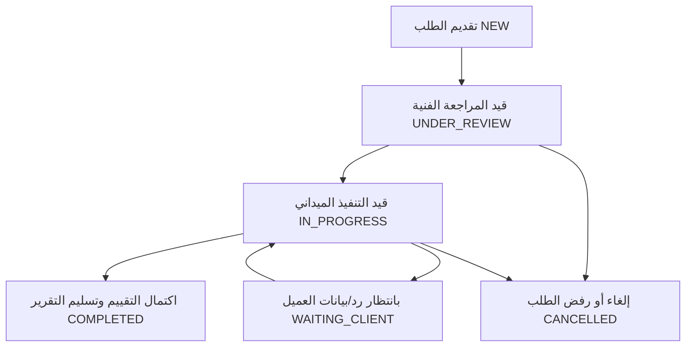
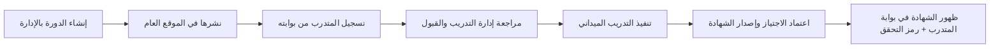

# مخطط تبسيط المنتج وتجربة المستخدم لمنصة FACSS
## FACSS PRODUCT & UX SIMPLIFICATION BLUEPRINT
### مركز عدن الأول للخدمات الأمنية والدراسات الاستراتيجية (Aden First Center for Security Services & Strategic Studies)

---

> **وثيقة معمارية وتخطيطية معتمدة**  
> **نوع الوثيقة:** تحليل معماري، إعادة هندسة تجربة المستخدم، وتبسيط وظيفي شامل (Analysis & Architecture Blueprint Only).  
> **الحالة:** مكتملة وجاهزة للمراجعة والاعتماد من قبل مالك وإدارة المركز قبل بدء التنفيذ البرمجي.

---

## 1. ملخص تنفيذي (Executive Summary)

أظهر التدقيق الفني والأمني الشامل لمشروع منصة مركز عدن الأول (FACSS) أن النظام يحتوي على أساس تقني قوي (Next.js 14, TypeScript, PostgreSQL, Prisma, Tailwind/Custom CSS)، وتم بنجاح إغلاق كافة الثغرات الأمنية الحرجة (P0 & P1) في المرحلة الأولى.

ومع ذلك، يعاني النظام الحالي وظيفياً ومعمارياً من **"تضخم برمجي ومحاكاة شكلية مفرطة" (Over-Engineering & Mock Proliferation)**:
1. **تشعب هائل في الصفحات (37 مساراً)**، كثير منها مكرر، أو يعرض نصوصاً ساكنة يمكن دمجها، أو صفحات عميقة تزيد من إرهاق الزائر والعميل.
2. **تشتت الأدوار والصلاحيات (9 أدوار)** لمركز أمني تشغيلي ناشئ ومتوسط، حيث توجد 4 رتب مدراء إداريين منفصلين دون حاجة تشغيلية حقيقية، مما يسبب تداخلاً وتعقيداً غير مبرر.
3. **واجهات إدارة شكلية (Read-Only Mock Tables)**: 6 من أصل 8 صفحات في لوحة الإدارة هي مجرد جداول قراءة لا تقدم أزرار إنشاء أو تعديل أو حذف (CRUD)، مع وجود أزرار معطلة كـ `onClick={undefined}` وتنبيهات `alert()` منبثقة بدائية.
4. **تعدد البوابات المشتتة**: بوابتان مستقلتان ومنفصلتان للعميل وللمتدرب، تحتويان على تكرار في تصميم الملف الشخصي، وإحصائيات وهمية ثابتة، وغياب لمحرك تخزين وتنزيل المستندات الحقيقي.
5. **جداول في قاعدة البيانات لا لزوم لها** (مثل نظام أخبار كامل `NewsArticle` لا توجد له أي واجهة عرض أو إدارة، وسجلات حضور يومية `AttendanceRecord` معقدة لا تتناسب مع دورات تدريبية مهنية مكثفة).

**الهدف الاستراتيجي من هذا المخطط (The Blueprint Goal):**  
إعادة هيكلة المنصة ونقلها من نموذج "النموذج الأولي المتضخم والشكلي" إلى **"منظومة مؤسسية أمنية، بسيطة، رصينة، وعملية بنسبة 100%"**:
- تقليص المسارات إلى شبكة ذكية مركزة لا تتجاوز الصفحات الأساسية.
- توحيد الصلاحيات في **4 أدوار واضحة وصارمة** فقط.
- تحويل لوحة الإدارة إلى **5 أقسام تشغيلية تفاعلية بالكامل**.
- دمج وتبسيط رحلة العميل ليحصل على تقاريره الأمنية في خطوتين فقط.
- صياغة خطة تنفيذية مقسمة إلى مراحل دقيقة دون المساس بالاستقرار أو التسرع في بناء ميزات لا تخدم المركز في عدن.

---

## 2. خريطة النظام الحالي (Current System Map)

فحص دقيق لكافة مكونات النظام البرمجية القائمة وتصنيف حالتها التشغيلية بدقة:

### أ. الصفحات العامة (Public Website Pages - 11 مساراً)
| المسار | الوصف الوظيفي الحالي | الحالة الفنية | التقييم المعماري |
| :--- | :--- | :---: | :--- |
| `/` | الصفحة الرئيسية (Hero, الركائز الست، الخدمات، التدريب، الأبحاث، الشركاء) | **PARTIAL** | متكاملة بصرياً لكن بعض الأزرار تشير لمسارات مكررة وتفتقر للربط مع إعدادات النظام الحية. |
| `/about` | صفحة عن المركز، الرؤية، الرسالة، والقيم | **FUNCTIONAL** | صفحة معلوماتية ممتازة ولكن تكرر محتوى الركائز الست الموجود في المنهجية. |
| `/services` | استعراض قائمة الخدمات الأمنية من قاعدة البيانات | **FUNCTIONAL** | جلب حي من Prisma لجميع الخدمات المفعلة. |
| `/services/[slug]` | الصفحة التفصيلية للخدمة مع مميزاتها ومراحلها وزر الطلب | **FUNCTIONAL** | ممتازة، ترتبط مباشرة بنموذج طلب الخدمة مع التحديد المسبق للخدمة. |
| `/training` | دليل الدورات التدريبية المتاحة للتسجيل | **FUNCTIONAL** | جلب حي للدورات ومواعيدها من Prisma. |
| `/research` | مستودع الدراسات والأوراق البحثية العامة | **FUNCTIONAL** | جلب حي للأبحاث العامة المعتمدة. |
| `/research/[slug]` | الصفحة التفصيلية لقراءة ملخص الدراسة وزر التحميل | **PARTIAL** | زر تحميل الـ PDF يعتمد على مسار نصي وهمي لعدم وجود محرك تخزين. |
| `/sectors` | صفحة مستقلة تعرض القطاعات المستهدفة (بنوك، موانئ، منظمات) | **UI_ONLY** | نصوص وصناديق ثابتة، لا تبرر وجود صفحة مستقلة ذات مسار منفصل في الهيدر. |
| `/methodology` | صفحة مستقلة للركائز الست والمقاربة الوقائية | **UI_ONLY** | تكرار حرفي لما هو معروض بالصفحة الرئيسية وصفحة "عن المركز". |
| `/contact` | نموذج الاتصال المؤسسي ومعلومات العنوان | **FUNCTIONAL** | إرسال حقيقي لقاعدة البيانات مع Rate Limiting وحماية ضد Spam. |
| `/request-service` | نموذج تقديم طلب خدمة أمنية رسمي | **FUNCTIONAL** | توليد رقم مرجعي فريد وربط اختياري مع حساب العميل المسجل. |

### ب. صفحات المصادقة (Authentication Pages - 2 مسار)
| المسار | الوصف الوظيفي الحالي | الحالة الفنية | التقييم المعماري |
| :--- | :--- | :---: | :--- |
| `/login` | تسجيل الدخول (بريد + كلمة مرور) | **FUNCTIONAL** | مؤمن بالكامل، تم تطهيره من بيانات الـ Demo وربطه بـ Rate Limit. |
| `/register` | إنشاء حساب جديد للعملاء والمتدربين | **FUNCTIONAL** | مؤمن ضد تصعيد الصلاحيات ويضبط حالة العميل كـ Pending Verification. |

### ج. لوحة الإدارة (Admin Panel Pages - 8 مسارات)
| المسار | الوصف الوظيفي الحالي | الحالة الفنية | التقييم المعماري |
| :--- | :--- | :---: | :--- |
| `/admin` | لوحة المؤشرات الإحصائية العامة | **PARTIAL** | تعرض عدادات إحصائية من Prisma ولكن بدون رسوم بيانية أو اختصارات تشغيلية. |
| `/admin/requests` | إدارة وتحديث طلبات الخدمات الأمنية | **FUNCTIONAL** | الشاشة الأكثر اكتمالاً: بحث، فلترة، مودال لتحديث الحالة وإضافة الملاحظات. |
| `/admin/messages` | صندوق استعراض رسائل نموذج التواصل | **PARTIAL** | جدول قراءة فقط؛ لا يوجد زر تغيير الحالة إلى "مقروءة" أو أرشفة أو رد. |
| `/admin/users` | جدول حسابات المستخدمين والصلاحيات | **PARTIAL** | جدول قراءة فقط؛ لا يمكن للمسؤول إنشاء مستخدم جديد أو تعطيل حساب أو تغيير رتبة. |
| `/admin/training` | جدول استعراض الدورات التدريبية | **BROKEN / PARTIAL** | جدول قراءة فقط، وزر "إضافة دورة جديدة" يحتوي على `onClick={undefined}`! |
| `/admin/research` | جدول استعراض الدراسات المنشورة | **PARTIAL** | جدول قراءة فقط؛ لا يوجد نموذج رفع دراسة جديدة أو تعديل مسودة. |
| `/admin/settings` | استعراض إعدادات الهوية والتواصل | **UI_ONLY / READ** | مجرد مربعات نصوص ثابتة، وتحث المسؤول على تعديل البيانات عبر Prisma Studio! |
| `/admin/logs` | سجل التدقيق والأنشطة الأمنية | **PARTIAL** | جدول قراءة فقط يرصد الأنشطة مع غياب خيارات الفلترة المتقدمة. |

### د. بوابة العميل (Client Portal - 5 مسارات)
| المسار | الوصف الوظيفي الحالي | الحالة الفنية | التقييم المعماري |
| :--- | :--- | :---: | :--- |
| `/portal/client` | لوحة متابعة العميل الرئيسية | **MOCK / PARTIAL** | تعرض طلبات العميل، ولكن بطاقة "التقارير السرية" تحتوي رقم 2 ثابت في الكود! |
| `/portal/client/requests` | سجل طلبات العميل الأمنية | **FUNCTIONAL** | جدول منظم يوضح حالة الطلبات والموظف المكلف ورابط المتابعة. |
| `/portal/client/requests/[id]` | شاشة تتبع الطلب وتفاصيله وملاحظاته | **FUNCTIONAL** | مؤمنة ضد IDOR وتتيح قراءة الملاحظات المخصصة للعميل. |
| `/portal/client/reports` | مستودع التقارير والدراسات السرية | **MOCK / UI_ONLY** | أزرار التحميل تطلق تنبيه بدائي `alert('جارٍ تجهيز المستند...')`. |
| `/portal/client/profile` | الملف التعريفي للمنشأة والعميل | **UI_ONLY / READ** | بطاقات ثابتة تعرض الاسم والبريد والقطاع بدون أي إمكانية للتعديل أو طلب التحديث. |

### هـ. بوابة المتدرب (Trainee Portal - 4 مسارات)
| المسار | الوصف الوظيفي الحالي | الحالة الفنية | التقييم المعماري |
| :--- | :--- | :---: | :--- |
| `/portal/trainee` | لوحة المتدرب الرئيسية | **MOCK / PARTIAL** | تعرض الدورات المسجلة، وبطاقة الحضور تعرض دائماً رقم "100%" ثابت في الكود! |
| `/portal/trainee/courses` | استعراض الدورات المتاحة والتسجيل | **UI_ONLY / MOCK** | زر "تأكيد التسجيل الآن" يطلق `alert()` ولا يرسل أي طلب للـ API! |
| `/portal/trainee/certificates` | استعراض الشهادات وطباعتها | **PARTIAL / UI_ONLY** | قالب الشهادة جميل ومحكم ولكن يعتمد على `window.print()` بدلاً من ملف PDF حقيقي. |
| `/portal/trainee/profile` | الملف التعريفي للمتدرب | **UI_ONLY / READ** | بطاقات قراءة فقط لا تتيح تحديث المؤهل أو رقم الهوية أو الهاتف. |

### و. واجهات الـ API الحالية (API Routes - 8 مسارات)
| المسار | الطريقة (Method) | الغرض | الحالة الفنية |
| :--- | :---: | :--- | :---: |
| `/api/auth/login` | `POST` | تسجيل دخول المستخدم وتعيين كوكيز JWT | **FUNCTIONAL** |
| `/api/auth/register` | `POST` | تسجيل حساب عميل/متدرب جديد مع التحقق | **FUNCTIONAL** |
| `/api/auth/me` | `GET` | فحص الجلسة وإرجاع بيانات المستخدم النشط | **FUNCTIONAL** |
| `/api/auth/logout` | `POST` | إبطال الجلسة ومسح ملف تعريف الارتباط | **FUNCTIONAL** |
| `/api/contact` | `POST` | استقبال رسائل التواصل وتخزينها | **FUNCTIONAL** |
| `/api/services` | `GET` | جلب قائمة الخدمات النشطة للواجهة | **FUNCTIONAL** |
| `/api/requests` | `GET`, `POST` | جلب الطلبات لمالكها/الموظف، وإنشاء طلب جديد | **FUNCTIONAL** |
| `/api/requests/[id]` | `GET`, `PATCH` | قراءة تفاصيل الطلب، وتحديث الحالة والملاحظات | **FUNCTIONAL** |

### ز. نماذج قاعدة البيانات الحالية (Prisma Models - 19 نموذجاً)
1. `User` (FUNCTIONAL): الحسابات الرئيسية وتأصيل الجلسات.
2. `ClientProfile` (FUNCTIONAL): معلومات منشأة العميل وحالة الاعتماد.
3. `ServiceCategory` (FUNCTIONAL): تصنيف الخدمات الأمنية.
4. `Service` (FUNCTIONAL): الخدمات ومميزاتها ومراحلها وقطاعاتها.
5. `ServiceRequest` (FUNCTIONAL): طلبات الخدمة ومتابعتها.
6. `ServiceRequestNote` (FUNCTIONAL): ملاحظات الطلبات (داخلية / مرئية للعميل).
7. `ServiceRequestDocument` (MISSING_BACKEND): جدول مرفقات الطلب (مسارات نصية بدون تخزين).
8. `CourseCategory` (FUNCTIONAL): تصنيف الدورات الأكاديمية.
9. `Course` (FUNCTIONAL): تفاصيل البرامج التدريبية ومواعيدها.
10. `TrainingRegistration` (FUNCTIONAL): تسجيل المتدربين في الدورات وحالاتهم.
11. `AttendanceRecord` (UNUSED / OVERKILL): سجلات الحضور اليومية لكل جلسة.
12. `Certificate` (PARTIAL): بيانات الشهادات المعتمدة وأرقام التحقق.
13. `ResearchCategory` (FUNCTIONAL): تصنيفات الدراسات والأبحاث.
14. `ResearchPublication` (FUNCTIONAL): الدراسات والتقارير الاستراتيجية ومستويات الرؤية.
15. `NewsArticle` (UNUSED): نموذج أخبار كامل مهجور بدون واجهات أو استعلامات.
16. `ContactMessage` (FUNCTIONAL): رسائل استمارة الاتصال.
17. `Notification` (PARTIAL): الإشعارات الداخلية للمستخدمين.
18. `SystemSetting` (READ_ONLY): إعدادات النظام ومعلومات الاتصال.
19. `ActivityLog` (FUNCTIONAL): سجل الأنشطة والتدقيق الأمني.

---

## 3. مشاكل التعقيد الحالية (Complexity & Over-Engineering Problems)

1. **ازدحام شريط التنقل العلوي (Navigation Clutter)**:  
   يحتوي الهيدر حالياً على 8 روابط رئيسية (`الرئيسية`, `عن المركز`, `خدماتنا`, `أكاديمية التدريب`, `مركز البحوث`, `قطاعات نخدمها`, `منهجية العمل`, `اتصل بنا`) بالإضافة لزر طلب الخدمة وزر تبديل اللغة وزر الدخول. هذا يشتت الزائر ويقلل من معدل التحويل (Conversion Rate).
2. **فصل "القطاعات" و"المنهجية" في صفحات معزولة**:  
   صفحة `/sectors` وصفحة `/methodology` لا تحتويان على تفاعل أو وظائف ديناميكية، ومكانهما الطبيعي هو إثراء صفحات "عن المركز" و"الخدمات".
3. **التضخم الإداري في الرتب (Role Proliferation)**:  
   وجود رتب مثل `CONTENT_MANAGER` و`SERVICE_MANAGER` و`TRAINING_MANAGER` و`RESEARCH_MANAGER` في مشروع لم ينطلق تشغيلياً بعد هو تعقيد غير عملي. في الواقع، فريق المركز في عدن يتكون من إدارة تنفيذية (`ADMIN`/`SUPER_ADMIN`) وموظفين أمنيين ومدربين ومستشارين (`STAFF`/`EMPLOYEE`).
4. **تعدد الشاشات المعزولة في بوابات المستخدمين**:  
   توزيع بوابة العميل على 5 صفحات وبوابة المتدرب على 4 صفحات يجعل الانتقال متعباً ويخلق صفحات شبه فارغة (مثل صفحة الملف الشخصي الساكنة).
5. **مأزق الميزات الشكلية (The Mock Trap)**:  
   وجود أزرار تطلق تنبيهات منبثقة بدائية `alert()` مثل "تحميل PDF" أو "تأكيد التسجيل" يضرب مصداقية المركز كجهة أمنية واستراتيجية محترفة، ويجب استبدالها إما بتدفقات عمل حقيقية وسريعة أو إخفاؤها مؤقتاً حتى اكتمالها.

---

## 4. مصفوفة القرارات الوظيفية (Decision Matrix: KEEP / SIMPLIFY / MERGE / REDESIGN / HIDE / REMOVE)

| العنصر (صفحة / ميزة / نموذج) | التصنيف الحالي | القرار المعماري | سبب القرار وخطة المعالجة |
| :--- | :---: | :---: | :--- |
| **الصفحة الرئيسية (`/`)** | Public Page | **SIMPLIFY** | الإبقاء عليها مع تنظيف روابط الأقسام وجعل الرسالة المؤسسية واضحة في 5 ثوانٍ فقط. |
| **صفحة عن المركز (`/about`)** | Public Page | **MERGE** | دمج محتوى صفحة `/methodology` (الركائز الست) داخلها لإنشاء مرجع مؤسسي متكامل في صفحة واحدة. |
| **صفحة منهجية العمل (`/methodology`)** | Public Page | **REMOVE (As Route)** | حذف المسار المستقل ودمج محتواه بالكامل داخل `/about` وقسم الركائز في الرئيسية. |
| **صفحة قطاعات نخدمها (`/sectors`)** | Public Page | **REMOVE (As Route)** | حذف المسار المستقل ودمجه كقسم فرعي أنيق داخل صفحة الخدمات `/services` وعرضه في الفوتر. |
| **صفحة الخدمات (`/services`)** | Public Page | **KEEP & ENRICH** | الإبقاء عليها مع تضمين القطاعات المستهدفة ومراحل التقديم لتوحيد الرؤية. |
| **تفاصيل الخدمة (`/services/[slug]`)** | Public Page | **KEEP** | مسار ممتاز يوجه الزائر لطلب الخدمة مباشرة مع التحميل المسبق لبيانات الخدمة. |
| **أكاديمية التدريب (`/training`)** | Public Page | **KEEP** | حيوية كذراع تدريبي للمركز واستعراض الدورات المعتمدة. |
| **مركز البحوث (`/research`)** | Public Page | **KEEP** | حيوية لإبراز الذراع الاستراتيجي والبحثي للمركز وبناء الثقة المؤسسية. |
| **تفاصيل البحث (`/research/[slug]`)** | Public Page | **SIMPLIFY** | تبسيط العرض، وحجب زر تحميل الـ PDF حتى يتم ربط مسار تخزين فعلي أو استبداله بقراءة كاملة. |
| **اتصل بنا (`/contact`)** | Public Page | **KEEP** | تعمل بكفاءة، وربط أرقام الهواتف ببيانات الإعدادات المركزية. |
| **طلب خدمة أمنية (`/request-service`)** | Public Core | **KEEP** | القمع التحويلي الأهم للمركز، يعمل بنجاح ويولد أرقام تتبع دقيقة. |
| **رتب المدراء الأربعة المتفرقة** | Roles | **MERGE** | دمج `CONTENT_MANAGER`, `SERVICE_MANAGER`, `TRAINING_MANAGER`, `RESEARCH_MANAGER` في دور موحد: `STAFF`. |
| **جدول الحضور اليومي (`AttendanceRecord`)** | DB Model | **REMOVE** | حذف التعقيد اليومي والاكتفاء بحالة الإنجاز ونسبة الحضور العامة داخل `TrainingRegistration`. |
| **جدول الأخبار (`NewsArticle`)** | DB Model | **HIDE_FOR_LATER** | تجميد النموذج في الوقت الراهن لعدم وجود متطلب فعلي للأخبار منفصلاً عن الأبحاث. |
| **بوابة العميل: التقارير (`/reports`)** | Portal Page | **MERGE** | دمج التقارير السرية داخل شاشة تفاصيل طلب الخدمة لربط كل تقرير بمهمته الأمنية. |
| **بوابة العميل: الملف الشخصي (`/profile`)** | Portal Page | **SIMPLIFY & MERGE** | دمج معلومات المنشأة في شريط جانبي أو تبويب مصغر داخل لوحة العميل بدلاً من صفحة مستقلة. |
| **بوابة المتدرب: التسجيل الوهمي** | Portal Action | **REDESIGN** | تحويل زر "تأكيد التسجيل" من `alert()` إلى استدعاء API حقيقي يسجل المتدرب في قاعدة البيانات. |
| **بوابة المتدرب: الشهادات (`/certificates`)**| Portal Page | **SIMPLIFY** | الإبقاء على الصفحة مع إضافة كود التحقق الرقمي السريع (QR/Code) المعتمد. |
| **لوحة الإدارة: زر إضافة دورة** | Admin Action | **REDESIGN** | استبدال `onClick={undefined}` بنافذة منبثقة (Modal) بسيطة لإنشاء دورة تدريبية وحفظها في DB. |
| **لوحة الإدارة: صفحة الإعدادات (`/settings`)**| Admin Page | **REDESIGN** | تفعيل نموذج حفظ حقيقي (Form Save) يسمح للمسؤول بتعديل أرقام الهواتف وعناوين التواصل فورياً. |
| **لوحة الإدارة: صفحة الرسائل (`/messages`)** | Admin Page | **SIMPLIFY** | إضافة إجراء "تحديد كمقروء" و"أرشفة" لتصبح الشاشة تفاعلية وعملية. |

---

## 5. معمارية الموقع العام النهائية المبسطة (Final Public Website Architecture)

### أ. هيكلية المعلومات والقائمة العلوية (Header Navigation)
لإنهاء التشتت البصري والوصول إلى معيار **"وضوح المركز في 5 ثوانٍ"**، يتم تقليص شريط التنقل العلوي من 8 روابط متناثرة إلى **5 روابط جوهرية فائقة الوضوح**:

```
[ الشعار الرسمي FACSS ]   [ الرئيسية ]   [ عن المركز ]   [ الخدمات الأمنية ]   [ أكاديمية التدريب ]   [ الدراسات والأبحاث ]   [ تواصل معنا ]      [ تبديل اللغة ]  [ زر: طلب خدمة أمنية ]  [ حسابي / الدخول ]
```

1. **الرئيسية (`/`)**: بوابة الهوية، التعريف السريع، الركائز الوقائية، وأبرز الخدمات والأنشطة.
2. **عن المركز (`/about`)**: يدمج الرؤية والرسالة، والركائز الست (المنهجية سابقاً)، والاعتمادات والقيادة.
3. **الخدمات الأمنية (`/services`)**: كتالوج الخدمات المتكاملة مدمجاً معها القطاعات الحيوية المستهدفة ومراحل التنفيذ.
4. **أكاديمية التدريب (`/training`)**: برامج التأهيل الأمني وبناء الكوادر والدورات المتاحة.
5. **الدراسات والأبحاث (`/research`)**: الذراع الاستراتيجي لخدمة صناع القرار والمؤسسات.
6. **تواصل معنا (`/contact`)**: بيانات العنوان في عدن، خريطة الموقع، أرقام الهاتف، واستمارة المراسلة.

*ملاحظة معماريّة:*  
- تم إلغاء `/methodology` كمسار منفصل ودمجه كقسم رئيسي داخل `/about`.  
- تم إلغاء `/sectors` كمسار منفصل ودمجه كقسم في أسفل `/services` وفي تذييل الموقع.

### ب. هيكلية التذييل (Footer Information Architecture)
يقسم الفوتر إلى 4 أعمدة وظيفية منظمة:
- **العمود الأول:** هوية المركز، الشعار المعتمد، الشعار اللفظي («أمانٌ يبدأ من عدن»)، ونبذة موجزة عن الترخيص والاعتماد.
- **العمود الثاني (الوصول السريع):** عن المركز، المنهجية الوقائية، القطاعات المستهدفة، اتصل بنا، سياسة السرية والخصوصية.
- **العمود الثالث (المنظومة التشغيلية):** خدمات الحراسات، تقييم الأمن المادي، الاستشارات، الأنظمة الإلكترونية، برامج التدريب، الأبحاث الاستراتيجية.
- **العمود الرابع (التواصل والبوابات):** العنوان في عدن، البريد المعتمد، أرقام الهواتف، ورابطان مباشران للدخول السريع: `بوابة العميل` و`بوابة المتدرب`.

### ج. محفزات التحويل الأساسية (Primary CTAs)
- **Primary CTA الرئيسي للموقع:** زر ذهبي ثابت في الهيدر والبانر الرئيسي: **«طلب خدمة أمنية / تقييم مخاطر»** يوجه مباشرة إلى `/request-service`.
- **Secondary CTA الثانوي:** **«استكشف المنظومة الأمنية»** يوجه إلى `/services`.
- **Academy CTA الخاص بالتدريب:** **«سجل في الدورة القادمة»** في قسم التدريب يوجه إلى استمارة التسجيل.

---

## 6. معمارية لوحة الإدارة المبسطة (Final Admin Architecture)

بدلاً من 8 صفحات مشتتة وساكنة، تقترح المعمارية **شريط جانبي مقتضب (5 وحدات تشغيلية فقط)** يغطي 100% من الاحتياجات الإدارية للمركز بنمط CRUD موحد:

```
┌────────────────────────────────────────────────────────┐
│                      FACSS ADMIN                       │
├────────────────────────────────────────────────────────┤
│  📊 1. لوحة المتابعة العامة      (/admin)              │
│  🛡️ 2. إدارة طلبات الخدمات      (/admin/requests)     │
│  🎓 3. أكاديمية التدريب          (/admin/training)     │
│  📚 4. الدراسات والأبحاث         (/admin/research)     │
│  ⚙️ 5. إعدادات وتشغيل المنظومة   (/admin/system)       │
└────────────────────────────────────────────────────────┘
```

### تفصيل الأقسام الإدارية الخمسة:

#### 1. لوحة المتابعة العامة (`/admin`) — [KEEP & ENRICH]
- **الغرض:** نظرة بانورامية سريعة للمدير العام.
- **المحتوى:**
  - 4 بطاقات إحصائية حية: (الطلبات الجديدة غير المعالجة، الدورات النشطة، الرسائل الواردة غير المقروءة، إجمالي العملاء النشطين).
  - جدول مصغر: "أحدث 5 طلبات خدمات تتطلب اتخاذ إجراء".
  - قائمة تنبيهات النظام السريعة.

#### 2. إدارة طلبات الخدمات الأمنية (`/admin/requests`) — [KEEP & ENHANCE]
- **الغرض:** المحور التشغيلي الأهم للمركز.
- **الوظائف:**
  - فلترة سريعة حسب الحالة (`NEW`, `UNDER_REVIEW`, `IN_PROGRESS`, `COMPLETED`, `CANCELLED`).
  - البحث بالرقم المرجعي أو اسم الجهة أو الهاتف.
  - نافذة تعديل الحالة (Modal): تغيير الحالة، تعيين الموظف المسؤول، كتابة ملاحظة داخلية خاصة بالموظفين، أو ملاحظة تظهر للعميل في بوابته، وإرفاق رابط التقرير الأمني المعتمد.

#### 3. أكاديمية التدريب والمتدربين (`/admin/training`) — [MERGE & ACTIVATE]
- **الغرض:** إدارة متكاملة للمنظومة التدريبية بدلاً من شاشة القراءة الحالية.
- **الوظائف:**
  - **تبويب الدورات:** استعراض الدورات، مع زر تشغيلي فعلي **«+ إضافة دورة تدريبية جديدة»** يفتح Modal لإدخال (العنوان بالعربية والإنجليزية، المدرب، التاريخ، المقاعد، والموقع).
  - **تبويب طلبات التسجيل:** مراجعة طلبات المتدربين الجدد واعتمادها (`APPROVE`) أو رفضها (`REJECT`).
  - **تبويب الشهادات:** إصدار شهادة معتمدة بضغطة زر وتوليد كود التحقق الرقمي الفريد تلقائياً.

#### 4. الدراسات والنشر الاستراتيجي (`/admin/research`) — [ACTIVATE]
- **الغرض:** إدارة الذراع البحثي للمركز.
- **الوظائف:**
  - جدول الدراسات المنشورة والمسودات.
  - زر **«+ إضافة دراسة / تقدير موقف»**: يفتح نموذج إدخال (العنوان، الملخص، الكاتب، التصنيف، وتحديد مستوى السرية: `عام PUBLIC` أو `حصري للعملاء CLIENT_ONLY`).
  - إمكانية تعديل حالة النشر (`DRAFT` / `PUBLISHED` / `ARCHIVED`).

#### 5. إعدادات وتشغيل المنظومة (`/admin/system`) — [MERGE]
- **الغرض:** دمج الشاشات المتفرقة (المستخدمين، الرسائل، الإعدادات، السجلات) في مركز تحكم إداري موحد عبر تبويبات أنيقة (Tabs):
  - **تبويب رسائل التواصل (Messages):** استعراض الرسائل، قراءتها، وتغيير حالتها إلى "تمت المراجعة".
  - **تبويب المستخدمين والصلاحيات (Users & RBAC):** استعراض المستخدمين، وتفعيل/تعطيل الحسابات (`isActive`), وتعيين الرتب.
  - **تبويب بيانات التواصل والهوية (Settings):** نموذج تفاعلي لتعديل (أرقام الهواتف الرسمية، الواتساب، البريد، العنوان في عدن، وروابط التواصل الاجتماعي) وحفظها فورياً في قاعدة البيانات.
  - **تبويب سجل التدقيق (Audit Logs):** مخصص للإدارة العليا لمتابعة الأنشطة الحساسة والتعديلات.

---

## 7. معمارية بوابة العميل المبسطة (Final Client Portal Architecture)

### الفلسفة التصميمية:
العميل المؤسسي (بنك، منظمة دولية، شركة نفطية) يحتاج إلى **منصة متابعة أمنية رصينة، سرية، ومباشرة** دون تشتيت في صفحات متعددة.

يتم دمج البوابة في **شاشتين رئيسيتين فقط**:
1. **لوحة العمليات والطلبات (`/portal/client`)**: تضم الطلبات الحالية، تتبع الحالات، والتقارير المعتمدة الجاهزة للتحميل.
2. **الملف المؤسسي والأمان (`/portal/client/profile`)**: التحقق من بيانات المنشأة وتغيير كلمة المرور.

### رحلة العميل الكاملة (The 8-Step Client Journey):
```
1. التسجيل المؤسسي (/register) 
   └── تسجيل بيانات الجهة (الشركة/المنظمة، المفوض، البريد الرسمي، الهاتف).
2. التحقق والاعتماد الداخلي (Verification)
   └── يدخل الحساب بحالة PENDING_VERIFICATION لحين مراجعة إدارة المركز لموثوقية الجهة.
3. الدخول وتقديم الطلب (/request-service)
   └── اختيار نوع الخدمة (تقييم أمني، حراسات منشآت)، وتوليد رقم التتبع المرجعي الفوري REQ-2026-XXXX.
4. إشعار البدء والتعيين (Assignment)
   └── تعيين مستشار أمني أو ضابط عمليات مكلف يظهر اسمه في لوحة العميل.
5. المتابعة الميدانية والتبادل التفاعلي (Live Tracking & Notes)
   └── استلام تحديثات فورية في بوابة العميل حول تقدم الفريق الميداني مع ملاحظات العمليات.
6. رفع التقرير السري (Confidential Report Delivery)
   └── بعد انتهاء التقييم الميداني، يرفع المستشار الأمني التقرير النهائي مشفراً في النظام وتتغير الحالة إلى REPORT_READY.
7. استلام وتحميل التقرير الآمن (Secure Download)
   └── يظهر للعميل زر تحميل مؤمن وخاص بالتقرير النهائي داخل صفحة طلبه دون الحاجة للانتقال لصفحات أخرى.
8. إغلاق الطلب وتقييم الخدمة (Completion)
   └── تحويل الحالة إلى COMPLETED وأرشفة الطلب للرجوع الدائم إليه في سجل المؤسسة.
```

---

## 8. معمارية بوابة المتدرب المبسطة (Final Trainee Portal Architecture)

### إعادة التقييم الواقعي لبوابة المتدرب:
- المتدرب في عدن هو شاب أو كادر أمني يسعى للتسجيل في دورات مثل (أمن وحماية المنشآت، الحراسات الخاصة، الإسعاف التكتيكي، السلامة المهنية).
- تعقيد تتبع الحضور اليومي لكل ساعة لكل جلسة هو عبء إداري غير مفيد. الأهم هو: **معرفة موعد ومكان الدورة، حالة القبول، استلام المنهج، ثم استعراض الشهادة المعتمدة**.

### شاشات بوابة المتدرب النهائية (2 شاشات):
1. **لوحة التدريب والدورات (`/portal/trainee`)**:
   - بطاقة: "الدورات النشطة حالياً" وموقعها ومواعيد الحضور.
   - قسم: "الدورات الجديدة المتاحة للتسجيل" مع **زر تسجيل حقيقي مرتبط بقاعدة البيانات**.
   - قسم: "سجل الدورات السابقة وحالة الاجتياز".
2. **سجل الشهادات والتحقق الرقمي (`/portal/trainee/certificates`)**:
   - عرض الشهادات الصادرة باسم المتدرب.
   - تضمين كود التحقق الرقمي الفريد (`FACSS-CERT-XXXX`).
   - زر طباعة مخصص، وإمكانية تحميل نسخة موثقة.

---

## 9. نموذج الصلاحيات والأدوار المبسط النهائي (Final Role & RBAC Model)

### تقليص الأدوار من 9 أدوار إلى 4 أدوار منطقية:
| الدور السابق في الكود | الدور المقترح النهائي | التبرير المنطقي |
| :--- | :---: | :--- |
| `SUPER_ADMIN` | **SUPER_ADMIN** | الإبقاء عليه للإدارة العليا والمالك (صلاحيات غير مقيدة، السجلات، المستخدمين). |
| `ADMIN` | **ADMIN** | الإبقاء عليه لمدير العمليات اليومية وإدارة النظام. |
| `CONTENT_MANAGER` | ➔ **STAFF** | دمج: لا حاجة لمدير محتوى مستقل في مركز أمني. |
| `SERVICE_MANAGER` | ➔ **STAFF** | دمج: يدخل ضمن فريق العمليات الموحد. |
| `TRAINING_MANAGER` | ➔ **STAFF** | دمج: مدربو ومسؤولو الأكاديمية هم موظفون بصلاحيات تشغيلية. |
| `RESEARCH_MANAGER` | ➔ **STAFF** | دمج: الباحثون والمحللون هم موظفون متخصصون. |
| `EMPLOYEE` | ➔ **STAFF** | دمج: يمثل الفريق الأمني والتنفيذي الميداني. |
| `CLIENT` | **CLIENT** | الإبقاء عليه للجهات والمؤسسات المستفيدة من الخدمات والتقارير. |
| `TRAINEE` | **TRAINEE** | الإبقاء عليه للملتحقين بدورات أكاديمية التدريب الأمني. |

### مصفوفة الصلاحيات المعتمدة النهائية (Final RBAC Matrix):

| الوظيفة / الإجراء | SUPER_ADMIN | ADMIN | STAFF | CLIENT | TRAINEE |
| :--- | :---: | :---: | :---: | :---: | :---: |
| **التحكم بالمستخدمين والرتب** | ✅ كامل | ❌ | ❌ | ❌ | ❌ |
| **تعديل إعدادات النظام الحساسة** | ✅ كامل | ✅ كامل | ❌ | ❌ | ❌ |
| **الاطلاع على سجلات التدقيق (Logs)** | ✅ كامل | ✅ كامل | ❌ | ❌ | ❌ |
| **تعديل وتحديث طلبات الخدمات والملاحظات** | ✅ كامل | ✅ كامل | ✅ مكلف به | ❌ | ❌ |
| **إنشاء وإدارة الدورات التدريبية** | ✅ كامل | ✅ كامل | ✅ مسموح | ❌ | ❌ |
| **نشر وتعديل الدراسات والأبحاث** | ✅ كامل | ✅ كامل | ✅ مسموح | ❌ | ❌ |
| **الرد على استفسارات التواصل** | ✅ كامل | ✅ كامل | ✅ مسموح | ❌ | ❌ |
| **دخول بوابة العميل ومتابعة طلباته فقط** | ❌ (مشاهدة بالإدارة) | ❌ | ❌ | ✅ طلباته فقط | ❌ |
| **دخول بوابة المتدرب واستعراض شهاداته** | ❌ (مشاهدة بالإدارة) | ❌ | ❌ | ❌ | ✅ سجلاته فقط |

---

## 10. دورة حياة طلب الخدمة الأمنية (Final Service Request Workflow)

لتفادي التضخم في الحالات غير المستخدمة، يتم اعتماد **6 حالات حقيقية واضحة**:



1. **NEW (طلب جديد)**: يدخل النظام فورياً من نموذج `/request-service`، ويرسل إشعاراً لغرفة العمليات.
2. **UNDER_REVIEW (قيد الدراسة والتقييم الأولي)**: تراجع العمليات نطاق المنشأة ومتطلبات الحماية أو التقييم وتحدد التكلفة والموظف المكلف.
3. **IN_PROGRESS (قيد التنفيذ الميداني)**: انتشار الفرق الأمنية أو مباشرة المستشار لتقييم المنشأة ميدانياً في عدن.
4. **WAITING_CLIENT (بانتظار متطلبات من العميل)**: إذا تطلب الأمر مخططات المبنى أو تصاريح خاصة.
5. **COMPLETED (مكتمل ومعتمد)**: تسليم التقرير السري أو تشغيل الحراسة وأرشفة الإجراء بنجاح.
6. **CANCELLED (ملغي / معتذر عنه)**: إذا اعتذر المركز لعدم توفر متطلبات السلامة أو انسحب العميل.

---

## 11. دورة حياة التدريب والشهادات (Final Training Workflow)



- **البيانات الأساسية للدورة:** الاسم بالعربية والإنجليزية، نبذة موجزة، المدرب، عدد الساعات، تاريخ البدء والانتهاء، والموقع الميداني.
- **حالة التسجيل:** `PENDING` ➔ `ACCEPTED` ➔ `COMPLETED` (أو `REJECTED`).
- **إصدار الشهادة:** عند تغيير حالة المتدرب إلى `COMPLETED`، يولد النظام تلقائياً سجلاً في جدول `Certificate` بكود تحقق آمن ومقاوم للتزوير (Hash / Unique Alpha-numeric).

---

## 12. معمارية إدارة المحتوى والأبحاث المبسطة (Final Research/Content Workflow)

- **رفض بناء CMS معقد:** بدلاً من تثبيت أنظمة إدارة محتوى ثقيلة أو بناء محررات Wysiwyg غير مستقرة، يعتمد المركز نمط CRUD بسيط وموحد لكافة المحتويات (الخدمات، الأبحاث، الدورات).
- **حالات النشر المعتمدة (3 حالات فقط):**
  - `DRAFT`: مسودة عمل مرئية للموظفين فقط لمراجعتها وتدقيقها.
  - `PUBLISHED`: منشورة ومعتمدة للجمهور.
  - `ARCHIVED`: مؤرشفة ومخفية من العرض العام مع الاحتفاظ بها في السجلات.
- **مستويات الرؤية في الدراسات:**
  - `PUBLIC`: دراسات واستطلاعات رأي مفتوحة للجميع لتعزيز سمعة المركز.
  - `CLIENT_ONLY`: تقارير استراتيجية حصرية ومصفوفات مخاطر تظهر فقط للعملاء المعتمدين المسجلين في النظام.

---

## 13. دورة حياة استفسارات التواصل (Final Contact Workflow)

1. **الاستقبال:** يدخل الاستفسار من صفحة `/contact` ويتم تخزينه في `ContactMessage` بحالة `UNREAD`.
2. **المراجعة:** في لوحة الإدارة تبويب "رسائل التواصل"، تظهر علامة تنبيه بالرسائل غير المقروءة.
3. **الإجراء:** يفتح المسؤول الرسالة ويطلع على تفاصيل الجهة ورقم الهاتف والبريد، وينقر على زر:
   - **«تم التواصل والمتابعة»**: يحول الحالة إلى `REPLIED`.
   - **«أرشفة»**: يحول الحالة إلى `ARCHIVED`.

---

## 14. معمارية المستندات والسرية الأمنية (Final Document Architecture)

تصنيف المستندات في منظومة FACSS خط أحمر أمني، ويتم تقسيمها إلى فئتين:

### أ. المستندات العامة (Public Assets):
- مثل: صور الأبحاث العامة، شعار المركز، بروشور الأكاديمية.
- تحفظ في مجلد الـ Static العام `/public/uploads/...` ويمكن لأي زائر الوصول إليها.

### ب. التقارير والوثائق السرية (Confidential Security Reports):
- مثل: تقارير تقييم الأمن المادي للمنشآت، مخططات الحراسة، ومرفقات العقود.
- **المعمارية الأمنية الصارمة:**
  1. تخزن في مجلد محمي خارج متناول الخادم العام (Private Storage Directory).
  2. **ممنوع تماماً** تقديم رابط مباشر للتحميل (No Direct URLs).
  3. يتم التحميل حصراً عبر مسار API مؤمن (مثال: `/api/documents/[id]/download`).
  4. يتحقق المسار أولاً من هوية الطالب:
     - هل هو المسؤول (`ADMIN` / `SUPER_ADMIN`)؟ مسموح.
     - هل هو العميل صاحب الطلب تحديداً (`session.userId === request.userId`)؟ مسموح.
     - أي طرف آخر (بما فيهم المتدربون أو عملاء آخرون) ➔ رفض فوري وقاطع بكود `403 Forbidden`.

---

## 15. معمارية الإعدادات وبيانات التواصل (Final Settings Architecture)

لتمكين إدارة المركز في عدن من إدارة المنصة باستقلالية تامة دون الحاجة للاستعانة بمبرمج في كل تعديل روتيني:

### أ. ما يمكن تعديله من لوحة الإدارة (`/admin/system` ➔ تبويب Settings):
1. أرقام الهواتف الرسمية وخطوط الطوارئ.
2. رقم الواتساب المخصص للاستفسارات السريعة.
3. عناوين البريد الإلكتروني الرسمية (العام، العمليات، التدريب).
4. العنوان المادي للمركز في عدن (الحي، الشارع، المعالم).
5. روابط منصات التواصل المعتمدة (LinkedIn, X, Facebook, YouTube).
6. ساعات العمل وأيام الاستقبال المكتبي.
7. رسالة الإعلان العلوي في الموقع (Announcement Bar) عند الحاجة.

### ب. ما يجب أن يظل صارماً في ملف `.env` (ممنوع عرضه في الواجهة):
1. سلسلة اتصال قاعدة البيانات (`DATABASE_URL`).
2. المفتاح السري لتشفير الجلسات (`AUTH_SECRET`).
3. مفاتيح واجهات الربط البرمجي الخارجية وبيانات الاعتماد السحابية.

---

## 16. المعمارية الموحدة للغتين (Final Bilingual Architecture - Arabic/English)

الواقع الحالي يحتوي على خليط من نصوص ثابتة ونصوص مترجمة، مع وجود صفحات عربية بالكامل.

### المعمارية المقترحة للنظام الثنائي:
1. **واجهة المستخدم الثابتة (Static UI Strings):**
   - تطوير `lib/i18n.ts` ليكون المرجع الشامل لكافة مفاتيح الترجمة.
   - دعم التبديل السلس للاتجاه (`dir="rtl"` للعربية و`dir="ltr"` للإنجليزية) مع استخدام متغيرات CSS للتباعد المنطقي (`margin-inline-start`, `padding-inline-end`).
2. **المحتوى الديناميكي في قاعدة البيانات (Dynamic DB Content):**
   - الحفاظ على النمط النظيف الحالي الثنائي في الجداول:
     - `titleAr` و `titleEn`
     - `descriptionAr` و `descriptionEn`
     - `contentAr` و `contentEn`
   - عند عرض المحتوى، يتم اختيار الحقل المناسب بحسب لغة الجلسة الحالية (`locale === 'ar' ? item.titleAr : (item.titleEn || item.titleAr)`).

---

## 17. مقترح نموذج البيانات النهائي (Final Data Model Proposal)

مراجعة شاملة لكافة نماذج Prisma الـ 19 بهدف إزالة الفائض وتوحيد الجداول:

```
[User] 1───1 [ClientProfile]
  │
  ├───0..* [ServiceRequest] 1───0..* [ServiceRequestNote]
  │                             └───0..* [ServiceRequestDocument]
  │
  ├───0..* [TrainingRegistration] 1───1 [Course]
  │         │
  │         └───0..1 [Certificate]
  │
  ├───0..* [Notification]
  └───0..* [ActivityLog]

[ServiceCategory] 1───0..* [Service]
[ResearchCategory] 1───0..* [ResearchPublication]
[ContactMessage]
[SystemSetting]
```

### جدول التقييم والقرارات على النماذج:
| النموذج (Model) | القرار | الإجراء المطلوب في مرحلة التطوير القادمة |
| :--- | :---: | :--- |
| `User` | **KEEP** | الإبقاء عليه مع تقليص الـ Role Enum إلى 4 أدوار فقط. |
| `ClientProfile` | **KEEP** | الإبقاء عليه لتخزين تفاصيل المنشأة والسجل التجاري والضريبي. |
| `ServiceCategory` | **KEEP** | الإبقاء عليه لتصنيف الخدمات. |
| `Service` | **KEEP** | الإبقاء عليه كمرجع متكامل للخدمات. |
| `ServiceRequest` | **KEEP** | الإبقاء عليه مع ضبط الـ Status Enum إلى الحالات الـ 6 المعتمدة. |
| `ServiceRequestNote`| **KEEP** | الإبقاء عليه للملاحظات المتبادلة والداخلية. |
| `ServiceRequestDocument` | **KEEP & ACTIVATE** | تفعيله بمحرك تخزين آمن لربط التقارير السرية المعتمدة. |
| `CourseCategory` | **KEEP** | تصنيف البرامج التدريبية. |
| `Course` | **KEEP** | تفاصيل الدورات والمقاعد والمواعيد. |
| `TrainingRegistration`| **MODIFY** | إضافة حقل `attendancePercentage` وحقل `finalGrade` بدلاً من جدول الحضور المنفصل. |
| `AttendanceRecord` | **REMOVE** | حذف النموذج الفائض لعدم وجود حاجة لتسجيل الحضور اليومي في هذه المرحلة. |
| `Certificate` | **KEEP** | إصدار الشهادات ورموز التحقق الإلكتروني. |
| `ResearchCategory` | **KEEP** | تصنيفات الدراسات والتقديرات الاستراتيجية. |
| `ResearchPublication`| **KEEP** | الدراسات ومستويات الرؤية (`PUBLIC` / `CLIENT_ONLY`). |
| `NewsArticle` | **REMOVE / HIDE** | إزالة أو تجميد جدول الأخبار لعدم وجود متطلب فعلي له حالياً. |
| `ContactMessage` | **KEEP** | استفسارات الجمهور والتواصل. |
| `Notification` | **KEEP** | الإشعارات اللحظية للعملاء والإدارة. |
| `SystemSetting` | **KEEP** | مفاتيح وقيم إعدادات التواصل والهوية. |
| `ActivityLog` | **KEEP** | سجل تدقيق العمليات الأمنية والإدارية. |

*النتيجة:* تقليص النماذج النشطة من 19 إلى 16 نموذجاً عالي الكفاءة والوضوح والترابط.

---

## 18. خريطة المسارات النهائية المقترحة (Final Target Route Map)

تقليص المسارات من **37 مساراً متشتتاً إلى 21 مساراً أساسياً فائق الكفاءة**:

```
facss-platform/
│
├── 🌐 الموقع العام (Public - 7 مسارات):
│   ├── /                         (الرئيسية مع الركائز والخدمات والأبحاث)
│   ├── /about                    (عن المركز مدمجاً به منهجية العمل)
│   ├── /services                 (الخدمات مدمجاً بها القطاعات المستهدفة)
│   ├── /services/[slug]          (تفاصيل الخدمة + التحويل للطلب)
│   ├── /training                 (دليل الدورات والتسجيل)
│   ├── /research                 (الدراسات والأوراق الاستراتيجية)
│   ├── /research/[slug]          (قراءة الورقة البحثية)
│   ├── /contact                  (التواصل الرسمي وموقع المركز)
│   └── /request-service          (نموذج تقديم طلب الخدمة والتقييم)
│
├── 🔐 الدخول والمصادقة (Auth - 2 مسارات):
│   ├── /login                    (تسجيل الدخول الموحد)
│   └── /register                 (تسجيل عميل جديد أو متدرب)
│
├── 🛡️ بوابة العميل (Client Portal - 2 مسارات):
│   ├── /portal/client            (لوحة العمليات والطلبات والتقارير المعتمدة)
│   └── /portal/client/requests/[id] (تتبع تفاصيل الطلب والملاحظات والتقرير)
│
├── 🎓 بوابة المتدرب (Trainee Portal - 2 مسارات):
│   ├── /portal/trainee           (الدورات المسجلة والدورات المتاحة للتسجيل)
│   └── /portal/trainee/certificates (الشهادات المعتمدة والتحقق الرقمي)
│
└── ⚙️ لوحة الإدارة الموحدة (Admin Panel - 5 مسارات):
    ├── /admin                    (المؤشرات الإحصائية العامة)
    ├── /admin/requests           (إدارة وتحديث ومتابعة طلبات الخدمات)
    ├── /admin/training           (إدارة الدورات والمتدربين والشهادات)
    ├── /admin/research           (إدارة ونشر الدراسات والأبحاث)
    └── /admin/system             (مركز التحكم: الرسائل، المستخدمين، الإعدادات، السجلات)
```

---

## 19. قواعد تبسيط تجربة المستخدم (UX Simplification Rules)

1. **قاعدة الـ 3 نقرات (3-Click Maximum Rule):** لا يجوز أن يستغرق الوصول إلى أي إجراء أساسي (طلب خدمة، متابعة تقرير، تنزيل شهادة) أكثر من ثلاث نقرات من الصفحة الرئيسية.
2. **استئصال الأرقام والبطاقات الوهمية:** منع أي بطاقة إحصائية ثابتة كـ "المستندات: 2" أو "الحضور: 100%". إن لم يكن الرقم مستخرجاً من Prisma لحظياً، يتم استبداله بحالة واضحة مثل "لا توجد تقارير جديدة".
3. **حظر التنبيهات المنبثقة البدائية (`alert()`):** استبدال جميع تنبيهات المتصفح البدائية بمكونات Toast راقية ومتناسقة مع الهوية البصرية.
4. **شاشات فارغة تفاعلية (Interactive Empty States):** عند عدم وجود طلبات أو دورات، تعرض الشاشة أيقونة هادئة مع زر إجراء مباشر (مثل: «لا توجد طلبات نشطة حالياً — [تقديم طلب خدمة جديد]»).
5. **تجربة الهواتف الذكية (Mobile Usability):** ضمان أن الجداول الكبيرة تتحول على الهواتف إلى بطاقات عمودية قابلة للمس (Responsive Cards) لسهولة قراءتها من قبل العملاء أثناء التنقل الميداني.
6. **احترام الهوية اللغوية:** تطبيق خط عربي رصين ومعتمد (مثل Cairo أو IBM Plex Sans Arabic) مع هوامش مريحة للقراءة وفواصل واضحة بين الفقرات.

---

## 20. خارطة طريق التنفيذ التدريجي (Development Priority Roadmap)

عند اعتماد هذا المخطط، يقترح تقسيم العمل البرمجي إلى **مراحل تتابعية محكمة** تضمن استمرار تشغيل النظام وأمانه دون أي ارتباك:

### المرحلة 2A: التأسيس وإعادة هيكلة المسارات والأدوار (Foundation & Cleanup)
- **النطاق:** توحيد الأدوار إلى 4 في الكود وPrisma، تنظيف شريط التنقل العلوي وتطبيق المسارات الـ 5 الأساسية، ودمج صفحات المنهجية والقطاعات.
- **الملفات المتأثرة:** `components/Header.tsx`, `components/Footer.tsx`, `lib/rbac.ts`, `app/about/page.tsx`, `app/services/page.tsx`.
- **معيار القبول:** نجاح البناء (Build) واختفاء التشتت في القوائم وتوافق فحص الأنواع (TypeCheck).

### المرحلة 2B: تطوير وتفعيل لوحة الإدارة التفاعلية (Interactive Admin Operations)
- **النطاق:** بناء مودال إضافة دورة في التدريب، ومودال نشر بحث، وتفعيل شاشة الإعدادات لحفظ بيانات التواصل الحقيقية، وإضافة أزرار المعالجة في الرسائل.
- **الملفات المتأثرة:** `app/admin/training/page.tsx`, `app/admin/research/page.tsx`, `app/admin/settings/page.tsx`, `app/admin/messages/page.tsx`.
- **معيار القبول:** قدرة المسؤول على تعديل بيانات التواصل وإنشاء دورة حقيقية دون لمس قاعدة البيانات يدوياً.

### المرحلة 2C: تبسيط وإحكام بوابة العميل وتسليم التقارير (Client Portal & Deliverables)
- **النطاق:** دمج صفحات بوابة العميل، ربط التقارير المعتمدة بمسار تنزيل مباشر في صفحة الطلب، وتطهير البيانات الوهمية.
- **الملفات المتأثرة:** `app/portal/client/page.tsx`, `app/portal/client/requests/[id]/page.tsx`.
- **معيار القبول:** وصول العميل لتقريره السري في خطوتين فقط مع منع أي عميل آخر من الوصول.

### المرحلة 2D: تفعيل بوابة المتدرب والتحقق الرقمي (Trainee Hub & Verification)
- **النطاق:** تفعيل زر التسجيل الفعلي في الدورات عبر API، وتبسيط قالب الشهادة الرقمية مع رمز التحقق.
- **الملفات المتأثرة:** `app/portal/trainee/courses/page.tsx`, `app/portal/trainee/certificates/page.tsx`.
- **معيار القبول:** تسجيل المتدرب بنقرة واحدة وظهوره فوراً في لوحة إدارة التدريب.

### المرحلة 2E: الصقل البصري والثنائي النهائي (UX Polish & Bilingual Readiness)
- **النطاق:** تكامل الإنجليزية والعربية في كافة النوافذ والمودالات، استبدال التنبيهات بـ Toast System حديث، ومراجعة استجابة الهواتف.
- **معيار القبول:** تجربة مستخدم مبهرة وسريعة ومطابقة لمعايير مراكز الدراسات والخدمات الأمنية الكبرى.

---

## 21. الميزات المؤجلة صراحة للمستقبل (Features Explicitly Deferred)
1. **نظام الدفع الإلكتروني (Online Payment Gateway):** مؤجل لعدم جاهزية البوابات المصرفية المحلية في اليمن لمثل هذه المعاملات؛ التعامل المالي يتم عبر اعتمادات وعقود مصرفية رسمية مباشرة.
2. **نظام الاختبارات الإلكترونية المؤتمتة (Online Quizzes/Exams):** التدريب في المركز أمني ميداني تطبيقي ولا يحتاج لاختبارات نظرية مؤتمتة في هذه المرحلة.
3. **التخزين السحابي الخارجي (AWS S3 Integration):** الاكتفاء حالياً بالتخزين المحلي المحمي والمنظم داخل خادم المنصة لتقليل التكاليف والتعقيد لحين توسع حجم الملفات.

---

## 22. الميزات والصفحات المقرر إزالتها نهائياً (Features Explicitly Removed)
1. **صفحة منهجية العمل المستقلة (`/methodology`)**: محتواها مكرر ومكانه الصحيح داخل "عن المركز".
2. **صفحة القطاعات المستقلة (`/sectors`)**: مجرد صناديق ثابتة ومكانها الطبيعي إثراء صفحة "الخدمات".
3. **جدول الحضور اليومي المنفصل (`AttendanceRecord`)**: تعقيد إداري غير مستخدم.
4. **جدول الأخبار المستقل (`NewsArticle`)**: كود مهجور وبلا واجهات.
5. **رتب المدراء الأربعة المتفرقة**: دمجها في رتبة `STAFF` لمنع التشتت والتعارض الصلاحياتي.
6. **الأزرار الوهمية المعتمدة على `alert()`**: حذفها واستبدالها بوظائف حقيقية أو إزالتها.

---

## 23. قرارات تشغيلية مفتوحة تتطلب موافقة مالك المركز (Open Business Decisions)

لضمان التطابق التام مع رؤية الإدارة العليا، نطلب موافقتكم الكريمة على النقاط التالية:
1. **اعتماد دمج شريط التنقل العلوي:** هل تؤيدون تقليص روابط الهيدر إلى 5 روابط فقط (`الرئيسية`, `عن المركز`, `خدماتنا`, `أكاديمية التدريب`, `الدراسات والبحوث`, `تواصل معنا`) لتحقيق أعلى معدل استجابة من الزوار؟
2. **اعتماد دمج الأدوار الوظيفية:** هل توافقون على توحيد رتب الإدارة في (Super Admin, Admin, Staff, Client, Trainee)؟
3. **بيانات الاتصال الرسمية:** يرجى تزويدنا برقم الهاتف المعتمد للمركز في عدن ورقم الواتساب الرسمي لإدراجهما مباشرة في لوحة الإعدادات.

---

## 24. المرحلة التنفيذية التالية الموصى بها بدقة (Recommended Next Implementation Phase)

المرحلة التالية الموصى بالبدء بها فور اعتمادكم لهذا المخطط هي:  
**المرحلة 2A (Foundation & Navigation Simplification)**  
- **الهدف:** تطبيق التقليص في شريط التنقل العلوي وتذييل الموقع، ودمج محتوى المنهجية والقطاعات في أماكنها الطبيعية، وتطهير المسارات غير الضرورية دون المساس بالبيانات أو أمان النظام.

---

> **تنبيه نظام التوقف (Stop Condition Met):**  
> تم الانتهاء بالكامل من إعداد وثيقة المخطط المعماري `FACSS_PRODUCT_UX_SIMPLIFICATION_BLUEPRINT.md`.  
> التزاماً بالتعليمات الصارمة، توقفت الآن تماماً دون إجراء أي تعديل على كود المشروع أو قواعد البيانات بانتظار مراجعتكم الكريمة واعتماد المخطط.
